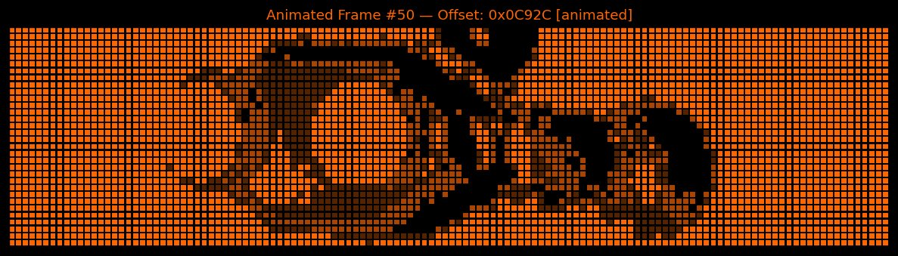
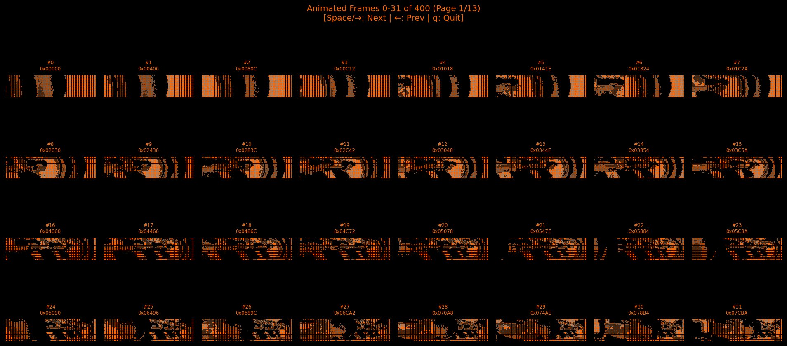

# SLEIC IO Moon Pinball — Reverse Engineering & Tools

<p align="center">
  
</p>

**IO Moon** is a pinball machine manufactured in 1996 by **SLEIC** (*Creaciones e Investigaciones Electrónicas, S.L.*) based in Alcobendas, Madrid, Spain. The theme revolves around a space exploration mission to Jupiter. The machine was designed by Luis J. Gosálbez Carrasco (software), Toñi Hernandez (software), and Santos Aranda (hardware).

This repository documents the results of an extensive reverse engineering effort on the IO Moon ROM images. It contains analysis tools, annotated disassembly listings, and technical documentation covering the dual-CPU hardware architecture, the DMD graphics format, the OKI sound chip, and a ROM patch for tournament play.

---

## Table of Contents

- [Hardware Overview](#hardware-overview)
- [Repository Structure](#repository-structure)
- [Scripts & Tools](#scripts--tools)
- [Technical Documentation](#technical-documentation)
- [Annotated Assembly Listings](#annotated-assembly-listings)
- [ROM Files](#rom-files)
- [Manuals](#manuals)
- [Related Work](#related-work)
- [License](#license)

---

## Hardware Overview

The IO Moon uses a **three-CPU architecture**:

| Component        | Specification                                                  |
|------------------|----------------------------------------------------------------|
| Main CPU         | Intel/AMD 80C188-10 (16-bit) — IC1 on board 011-029            |
| I/O CPU          | Zilog Z80A @ 8 MHz — IC1 on board 011-030                      |
| Display CPU      | Microchip PIC 16C54HS — IC23 on board 011-029                  |
| Game ROM         | 2× 27C040 (IC10 `1001`, IC11 `1002`; 1 MB total)               |
| Sound ROM        | 2× 27C040 (IC52 `1003`, IC53 `1004`; 1 MB total)               |
| Z80 ROM          | 27C256 (IC5 `1005`, 32 KB)                                     |
| NVRAM            | 28C64A EEPROM (IC14, 8 KB)                                     |
| Music balance    | XICOR X9103 digital potentiometer (IC63) — *not* NVRAM         |
| Display          | 128×32 **gas plasma** dot panel, 4 brightness levels           |
| Sound            | OKI MSM6376 ADPCM (IC51), Yamaha YM3812 FM (IC60) + YM3014 DAC (IC61) |
| Power            | 220 V AC (European market)                                     |

The **80188** runs game logic, the state machine, scoring, and the inter-CPU mailbox. The **Z80** scans the switch matrix, drives the lamp matrix and solenoids, and feeds the OKI MSM6376. The **PIC 16C54HS** is dedicated to producing the DMD raster signal — the 80188 writes frame data and control words into the DMD register area at segment `A000h`, and the PIC converts these into the timing the plasma panel needs.

The 80188 and Z80 communicate through shared RAM at segment `4000h` using a HOLD/HLDA bus arbitration scheme.

For a detailed breakdown of the hardware architecture, see:

- [Hardware Architecture](docs/hardware_architecture.md) — CPU boards, memory map, bus arbitration
- [DMD Graphics System](docs/dmd_graphics.md) — Display format, bitplanes, frame encoding
- [DMD Wire Protocol](docs/dmd_wire_protocol.md) — Signals on the PIC→plasma panel ribbon, frame-detect timing, measured clock rates
- [YM3812 PinMAME Precedents](docs/ym3812_pinmame_precedents.md) — How other PinMAME drivers attach the YM3812; what that implies for IO Moon
- [Switch, Lamp & Solenoid Tables](docs/switch_lamp_solenoid.md) — Complete I/O mapping from the service manual
- [Z80 I/O Port Map](docs/z80_io_ports.md) — Port assignments and switch matrix scan routine
- [80188 Peripheral Configuration](docs/80188_config.md) — Chip select registers and memory mapping
- [Inter-CPU Communication](docs/inter_cpu_communication.md) — Shared memory protocol and mailbox system

---

## Repository Structure

```
sleic-io-moon/
├── README.md                          # This file
├── scripts/
│   ├── dmd_viewer.py                  # DMD graphics viewer & exporter
│   ├── extract-oki-msm6376.py         # OKI ADPCM sound sample extractor
│   └── io_moon_press_start_patch.py   # Tournament "PRESS START" ROM patch
├── docs/
│   ├── dmd_viewer.md                  # DMD Viewer documentation
│   ├── extract_oki_msm6376.md         # OKI extractor documentation
│   ├── press_start_patch.md           # PRESS START patch documentation
│   ├── hardware_architecture.md       # Hardware architecture overview
│   ├── dmd_graphics.md                # DMD graphics format & encoding
│   ├── switch_lamp_solenoid.md        # Switch, lamp, and solenoid tables
│   ├── z80_io_ports.md                # Z80 I/O port map & scan routine
│   ├── 80188_config.md                # 80188 peripheral configuration
│   ├── inter_cpu_communication.md     # Shared memory & bus arbitration
│   └── game_software.md               # Game state machine & boot sequence
├── asm/
│   ├── 80188_annotated.asm            # Fully annotated 80188 ROM disassembly
│   └── z80_annotated.asm              # Fully annotated Z80 ROM disassembly
├── roms/
│   ├── 1.3 Early version/             # Early ROM set
│   │   ├── README.md
│   │   ├── V1 3_01.bin                # Display ROM 1 (80188)
│   │   ├── V1 3_02.bin                # Display ROM 2 (DMD graphics)
│   │   ├── V1 3_03.bin                # Sound ROM 1 (OKI)
│   │   ├── V1 3_04.bin                # Sound ROM 2 (OKI)
│   │   └── V1 3_05.bin                # Z80 CPU ROM
│   └── 1.3 IPDB latest/               # Latest ROM set from IPDB
│       ├── README.md
│       ├── V1 3_01.bin                # Display ROM 1 (80188)
│       ├── V1 3_02.bin                # Display ROM 2 (DMD graphics)
│       ├── V1 3_03.bin                # Sound ROM 1 (OKI)
│       ├── V1 3_04.bin                # Sound ROM 2 (OKI)
│       ├── V1 3_05.bin                # Z80 CPU ROM
│       └── Start-Tournament-Patch/    # Tournament patch for this ROM set
│           ├── README.md
│           └── V1 3_01.bin            # Patched Display ROM 1
├── images/                            # Screenshots from the DMD viewer
│   ├── dmd_single_frame.png
│   ├── dmd_static_screen.png
│   ├── dmd_grid_animated.png
│   ├── dmd_fonts.png
│   ├── dmd_dot_comparison.png
│   └── dmd_invert_comparison.png
└── manuals/
    ├── README.md
    └── sleic_io_moon_manual_es.pdf    # Original Spanish service manual
```

---

## Scripts & Tools

### [DMD Viewer](docs/dmd_viewer.md) — `scripts/dmd_viewer.py`

A Python tool for viewing, analyzing, and exporting DMD graphics from the IO Moon ROM. It can decode animated frames (400 frames, 2-bitplane, 4 brightness levels), static screens (274 bilingual text screens), scrolling credits, and font glyphs (131 characters in multiple sizes).

<p align="center">
  
</p>

### [OKI MSM6376 Sound Extractor](docs/extract_oki_msm6376.md) — `scripts/extract-oki-msm6376.py`

Extracts individual ADPCM audio samples from OKI MSM6376 sound ROM files. The MSM6376 stores audio in 4-bit IMA/OKI ADPCM format. This tool reads the chip's internal sample index, extracts each sample as raw PCM, and optionally converts them to WAV files using FFmpeg.

### [PRESS START Patch](docs/press_start_patch.md) — `scripts/io_moon_press_start_patch.py`

A ROM patch for tournament use. After a game ends, the original IO Moon immediately transitions to attract mode, making it impossible to photograph or record final scores. This patch injects 80188 machine code into unused ROM space that displays "PRESS START" on the DMD and waits for the START button before returning to attract mode.

<p align="center">
  <a href="https://www.youtube.com/watch?v=wjNdBtwymYc">
    
  </a>
  <br>
  <em>Click to watch the PRESS START patch in action</em>
</p>

---

## Technical Documentation

Detailed write-ups covering the IO Moon hardware and software, based on ROM reverse engineering and the original SLEIC service manual:

| Document | Description |
|----------|-------------|
| [Hardware Architecture](docs/hardware_architecture.md) | Dual-CPU design, CPU board components, memory map, power connectors |
| [DMD Graphics System](docs/dmd_graphics.md) | Frame format (header, bitplanes, encoding), static screens, fonts, credits |
| [Switch, Lamp & Solenoid Tables](docs/switch_lamp_solenoid.md) | All 50 switches, 64 lamps, and 18 solenoids with codes and descriptions |
| [Z80 I/O Port Map](docs/z80_io_ports.md) | Port assignments, switch matrix scan routine, key Z80 RAM addresses |
| [80188 Peripheral Configuration](docs/80188_config.md) | RELREG, chip selects (UMCS, LMCS, PACS, MMCS), wait states |
| [Inter-CPU Communication](docs/inter_cpu_communication.md) | Shared RAM at segment 4000h, HOLD/HLDA bus arbitration, mailbox protocol |
| [Game Software Architecture](docs/game_software.md) | Boot sequence, main loop, state machine, text encoding, configuration system |

---

## Annotated Assembly Listings

The `asm/` directory contains fully annotated disassembly listings for both CPUs:

- **`80188_annotated.asm`** — The complete 80188 main CPU ROM (~10,458 instructions across segments D000h, E000h, and F000h). Covers the game state machine, DMD display routines, configuration system, scoring, and the boot sequence.

- **`z80_annotated.asm`** — The Z80 coprocessor ROM (27C256, 32 KB). Covers switch matrix scanning, lamp matrix control, solenoid drivers, OKI MSM6376 sound interface, and communication with the 80188 via the shared mailbox byte at `C0FC`.

---

## ROM Files

The `roms/` directory has placeholders for two known ROM sets. The IO Moon uses 5 ROM chips:

| Filename      | Chip   | Size | CPU | Content                                           |
|---------------|--------|------|-----|---------------------------------------------------|
| `V1 3_01.bin` | 27C040 | 512 KB | 80188 | Display ROM 1 (ROM1: game code + upper graphics)  |
| `V1 3_02.bin` | 27C040 | 512 KB | 80188 | Display ROM 2 (ROM2: lower graphics / DMD frames) |
| `V1 3_03.bin` | 27C040 | 512 KB | OKI | Sound ROM 1                                       |
| `V1 3_04.bin` | 27C040 | 512 KB | OKI | Sound ROM 2                                       |
| `V1 3_05.bin` | 27C256 | 32 KB | Z80 | CPU ROM (switch/lamp/solenoid/sound control)      |

To create a combined 1 MB ROM for use with `dmd_viewer.py`:

```bash
cat "V1 3_02.bin" "V1 3_01.bin" > io_moon_combined.bin
```

```cmd
copy /b "V1 3_02.bin" + "V1 3_01.bin" io_moon_combined.bin
```

> **Note:** ROM2 goes first (lower addresses 0x00000–0x7FFFF), then ROM1 (upper addresses 0x80000–0xFFFFF).

---

## Manuals

- [Original Spanish Service Manual](manuals/sleic_io_moon_manual_es.pdf) — 114 pages + 30 schematic pages


---

## Related Work

This repository supersedes the standalone [extract-oki-adpcm-from-rom](https://github.com/gerwout/extract-oki-adpcm-from-rom) repository. The OKI MSM6376 extractor script is now maintained here as part of the broader IO Moon reverse engineering effort. The standalone repository is deprecated.

Discussion about this project can be found on [Pinside](https://pinside.com/pinball/forum/topic/tool-to-extract-sound-from-a-sleic-rom-file).

---

## License

The scripts in this repository are released under the MIT License. The annotated disassembly listings and documentation are provided for educational and preservation purposes. All reverse engineering was conducted in accordance with Dutch and EU law, which permits reverse engineering for interoperability and error correction purposes.

SLEIC, IO Moon, and all related trademarks belong to their respective owners.
