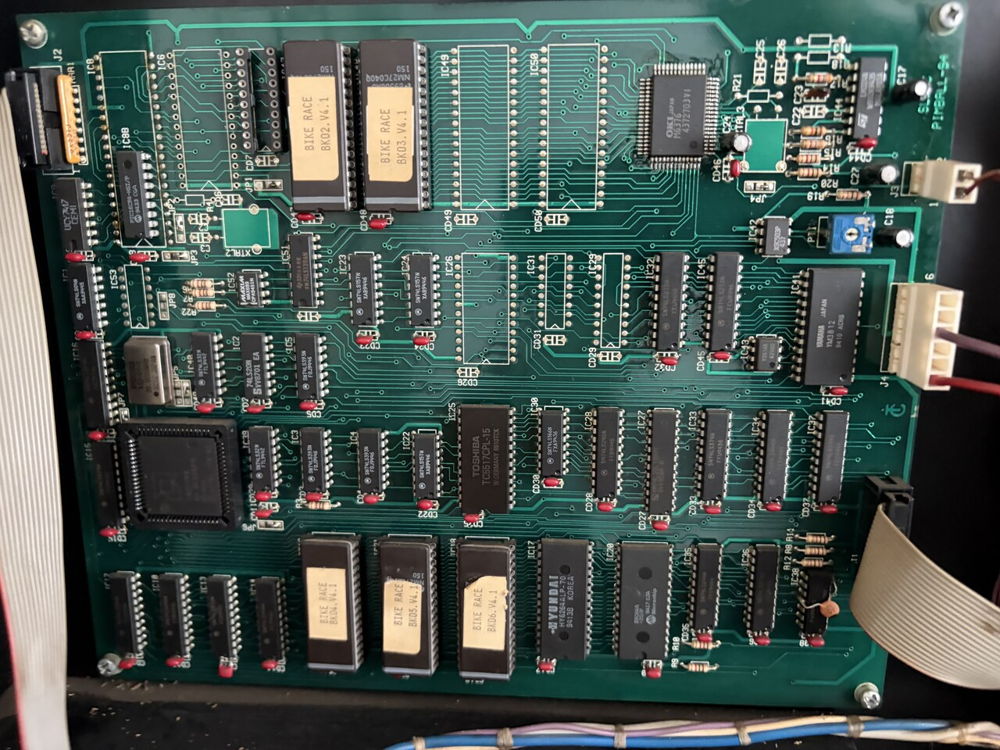
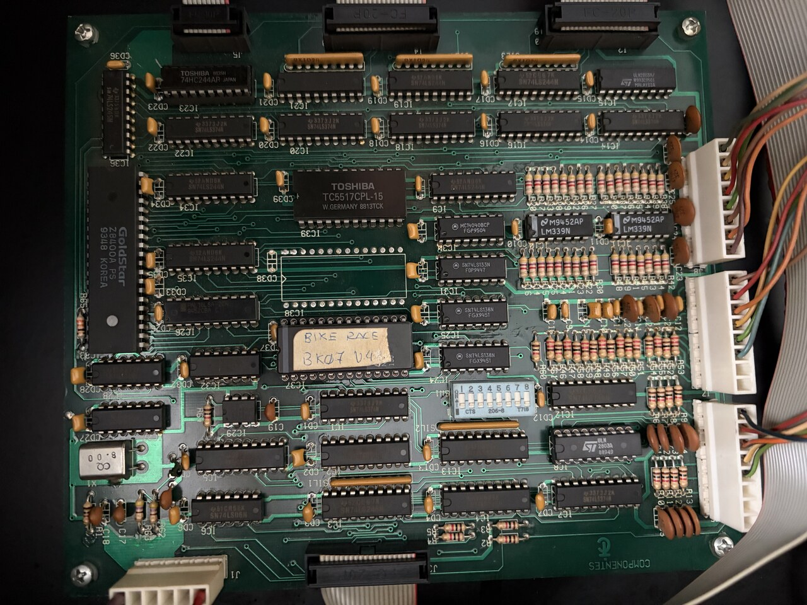

# Bike Race — Board Photographs and IC Complement

Two high-resolution photographs of a Bike Race machine's backbox boards, taken
from a machine wearing a **V4.1 chip set**. They are the only Bike Race board
photographs in this repository, and they are here for the same reason the IO Moon
board photographs are: good pictures of SLEIC boards are hard to come by, and the
sticker text and unpopulated footprints they show answer questions the ROM images
alone cannot.

Both are also the physical counterpart to
[`../roms/related-machines/bike-race/v4.1/`](../roms/related-machines/bike-race/v4.1/) —
every socketed ROM in the two pictures is a chip in that set.

The Z80 board is presented rotated 180° from the shot as taken, so that the IC part
numbers and the ROM sticker read upright.

## The 16-bit board (80188)

  

Silkscreen: **`SLEIC` / `PINBALL-94`**, lower right. No `011-0xxA` board number is
visible anywhere on the board, which is how the IO Moon boards are identified — so
this board is named by its silkscreen here, not by a part number.

What is legible:

| Position | Part | Role |
|----------|------|------|
| — | 68-pin PLCC beside a metal-can oscillator, lower left | The 80188. Its markings are lost to flash glare; so is the oscillator's frequency. |
| — | **OKI M6376**, PLCC, marked `M6376 4372103V1` | ADPCM speech / effects |
| — | **Yamaha YM3812**, date code `9410` | FM music (OPL2) |
| IC47, IC48 | `NMC27C040Q-150`, stickers **`BIKE RACE BK02.V4.1`** and **`BIKE RACE BK03.V4.1`** | the two OKI sample ROMs, 512 KB each |
| IC49, IC50 | **unpopulated** 32-pin footprints — bare pads, not even sockets, but with traces run to them | two further sample-ROM positions the board provides and this machine does not use |
| lower row, left of IC17 | three 27C010-class EPROMs, stickers **`BIKE RACE BK04.V4.1`**, **`BK05.V4.1`**, **`BK06.V4.1`** | 80188 code and the two graphics ROMs, 128 KB each |
| IC17 | `HYUNDAI HY6264ALP-70`, date `9413` | 8 K × 8 work RAM |
| IC20 | `Microchip 28C64A-20/P`, date `9417` | the non-volatile store — confirms the 28C64A named in [`sleic_board_family.md`](sleic_board_family.md) |
| IC25 | `TOSHIBA TC5517CPL-15` | 2 K × 8 CMOS SRAM |
| IC42 | `X9C503P` | digital potentiometer — the FM-vs-OKI balance control, the same part IO Moon carries at IC63 |
| IC44 | `LM324` (ST) | quad op-amp, in the analogue section beside the `PT1` trimmer |

### The ROM complement is three game/graphics ROMs, not four

This is the photograph's most useful single fact. The lower row holds **exactly
three** 27C010 positions — `BK04`, `BK05`, `BK06` — and the next two devices along
are the work RAM and the EEPROM, not a fourth ROM. Counting the whole machine:
five chips on this board, `BK07` on the Z80 board, and `BK01` on the display board
that is not photographed here, for **seven chips total**, which is the same
complement PinMAME's `SLEIC3` driver expects.

That mattered for the V4.1 set, which used to render garbage artwork under
PinMAME. A missing fourth graphics ROM would have explained it; this photograph
ruled that out, and the cause turned out to be a bad dump of ROM 06. See
[`../roms/related-machines/bike-race/v4.1/README.md`](../roms/related-machines/bike-race/v4.1/README.md).

The four sample-ROM positions with only two stuffed are a separate observation and
do not affect the game code: `IC49`/`IC50` are OKI sample ROMs, and the OKI is
driven by phrase number, not by an address the 80188 computes.

## The Z80 I/O board

  

Silkscreen: **`COMPONENTES`** with a circled-T maker's mark, and again no
`011-0xxA` number.

| Position | Part | Role |
|----------|------|------|
| — | **`GoldStar Z8400A PS`**, date `9348`, Korea | the Z80A |
| **X1** | crystal marked **`CQ 8.00`** | 8.00 MHz, adjacent to the CPU section |
| IC37 | 27C256, sticker **`BIKE RACE BK07 V.4.1`** | the Z80 I/O ROM |
| IC38 | **unpopulated** 28-pin footprint directly above `BK07` | a second memory position this machine does not use |
| IC39 | `TOSHIBA TC5517CPL-15`, `W.GERMANY 8813CK` | 2 K × 8 CMOS SRAM |
| SW1 | `CTS 206-8`, marked `T718` | the 8-way configuration DIP |
| — | `ULN2803A` (ST) arrays, `LM339N` comparators, `74LS240`/`74LS244`/`74LS374` ranks along the connector edge | switch-matrix, lamp and driver I/O |
| — | `MC14040BCP`, `74LS133`, two `74LS138` | counter and address decode |

Individual DIP-switch positions are not called out here: the sliders are legible as
hardware but the photograph does not resolve their up/down states reliably enough
to record.

### The 8.00 MHz crystal

`X1` is an 8.00 MHz crystal on the Z80 board, which is the same board-level number
IO Moon's Z80 board carries at `X10`. It does **not** by itself settle either
machine's Z80 clock — that depends on the divider between the crystal and the CPU's
`CLK` pin, which is a PAL/logic question this photograph cannot answer, and the
`IO Moon` Z80 clock remains an open calibration item. What it does confirm is that
the 8 MHz board crystal is a family-wide feature and not an IO Moon peculiarity.

## Provenance

Both photographs were taken by the owner of the machine in September 2026 and
contributed to this repository. They are the owner's own work, contributed under
the same terms as the rest of the original material here.
