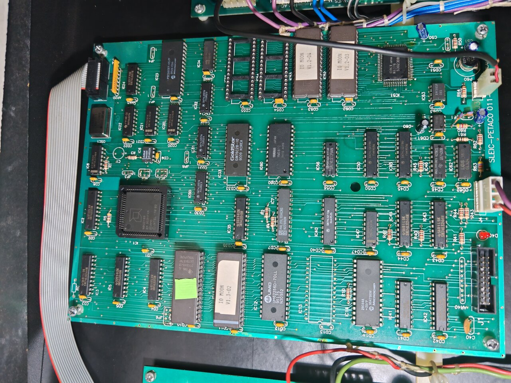

# 011-029A (16-bit / 80188 board) — IC inventory

[← Back to main README](../README.md)

  
   
  <em>011-029A — 16-bit / 80188 CPU board. Click the image for the full 4096 × 3072 photograph.</em>

This is the complete list of integrated circuits populated on the IO Moon 16-bit CPU board (silkscreen `011-029A`), together with the function of each part. Identifications are based on direct readout of the chip top-marks plus public datasheets for the part numbers. The **Datasheet** column links to an offline copy of each part's datasheet under [`../datasheets/`](../datasheets/) (see the [datasheet catalogue](../datasheets/README.md) for sources and equivalent-part notes).

The Z80 / sound-driver board (`011-030A`) is documented separately.

## Summary by function

| Group | ICs | Purpose |
|-------|-----|---------|
| Main CPU & bus glue | IC1, IC2, IC3, IC4, IC5, IC6, IC7, IC8, IC35, IC43, IC44, IC47 | 80188 CPU, address/data demultiplex, chip-select decode, reset/supervisor. |
| Program / display ROM | IC10, IC11 | Two 27C040 EPROMs holding game code and DMD frames, mapped by the 80188. |
| RAM | IC12, IC33 | 32 K × 8 main work RAM (IC12) plus a small 2 K × 8 scratchpad (IC33). |
| NVRAM | IC14 | 28C64A EEPROM for operator settings and high scores. |
| DMD coprocessor | IC23 | PIC 16C57 microcontroller — raster-drives the DMD. The YM3812 is **not** driven by the PIC; the 80188 drives it directly via `/PCS5` (see the IC23 and IC60 rows below). |
| Glue / timing | IC20, IC21, IC22, IC24, IC30, IC31, IC34, IC40, IC46, IC50, IC56 | Counters, multiplexers, latches, NOR/OR gates, open-collector drivers. |
| Sound | IC51, IC52, IC53, IC60, IC61, IC62, IC63 | OKI ADPCM voice synth, OPL2 FM synth, DAC, op-amp, digital pot, sample ROMs. |

## Full IC list

| IC | Part | Package | Datasheet | Function |
|----|------|---------|-----------|----------|
| IC1  | AMD N80C188                  | PLCC-68 | [80c188.pdf](../datasheets/80c188.pdf) | Main 16-bit CPU. 80186-compatible, with integrated DMA, timers, interrupt controller and chip-select unit. |
| IC2  | TI SN74LS373N                | PDIP-20 | [74ls373.pdf](../datasheets/74ls373.pdf) | Octal D-type transparent latch. Demultiplexes the 80188 address/data bus (low-byte address latch). |
| IC3  | TI SN74LS244N                | PDIP-20 | [74ls244.pdf](../datasheets/74ls244.pdf) | Octal buffer / line driver, 3-state. |
| IC4  | TI SN74LS373N                | PDIP-20 | [74ls373.pdf](../datasheets/74ls373.pdf) | Octal D-type transparent latch. Companion to IC2. |
| IC5  | TI SN74LS245N                | PDIP-20 | [74ls245.pdf](../datasheets/74ls245.pdf) | Octal bus transceiver, 3-state. Data-bus buffer. |
| IC6  | Maxim MAX699                 | DIP-8   | [max699.pdf](../datasheets/max699.pdf) | Microprocessor supervisor: power-on reset, brownout detect, watchdog timeout, NVRAM write protect. |
| IC7  | AMD/MMI PAL20L10ACNS         | PDIP-24 | [PAL handbook](../datasheets/pal20l10_pal16l8_mmi_pal_handbook_1983.pdf) | Programmable Array Logic — 80188 chip-select / bus glue. **Undumped** (see [`chips_to_dump.md`](chips_to_dump.md)). |
| IC8  | National DM74LS74AN          | PDIP-14 | [74ls74a.pdf](../datasheets/74ls74a.pdf) | Dual D-type positive-edge-triggered flip-flop with preset / clear. |
| IC10 | EPROM 27C040                 | PDIP-32 | [27c040.pdf](../datasheets/27c040.pdf) | First display / code ROM (512 KB). Mapped by the 80188 via LMCS. |
| IC11 | EPROM 27C040                 | PDIP-32 | [27c040.pdf](../datasheets/27c040.pdf) | Second display / code ROM (512 KB). |
| IC12 | UMC UM62256D-70LL            | PDIP-28 | [62256](../datasheets/62256_generic_as6c62256.pdf) | 32 K × 8 CMOS SRAM, 70 ns. Main 80188 work RAM. |
| IC14 | Microchip 28C64A             | PDIP-28 | [28c64a.pdf](../datasheets/28c64a.pdf) | 8 K × 8 parallel EEPROM. NVRAM — operator settings, high scores. |
| IC20 | National DM74LS393N          | PDIP-14 | [74ls393.pdf](../datasheets/74ls393.pdf) | Dual 4-bit binary ripple counter. Part of the clock-divider chain. |
| IC21 | National DM74LS393N          | PDIP-14 | [74ls393.pdf](../datasheets/74ls393.pdf) | Dual 4-bit binary ripple counter. |
| IC22 | TI SN74LS27N                 | PDIP-14 | [74ls27.pdf](../datasheets/74ls27.pdf) | Triple 3-input NOR gate. |
| IC23 | Microchip PIC 16C57-HS/P     | PDIP-28 | [pic16c5x.pdf](../datasheets/pic16c5x.pdf) | DMD raster coprocessor (RDATA / RCLK / COLATCH / DE / VSYNC / VA3–VA12 to the plasma panel). Does **not** drive the YM3812 — verified from the 011-029-07 schematic: every PIC I/O pin is a DMD signal and the YM3812 is selected by the 80188's `/PCS5`. 2048 × 12-bit OTP program memory, 72 bytes RAM, 20 I/O pins. **Undumped** (see [`chips_to_dump.md`](chips_to_dump.md)). |
| IC24 | TI SN74LS07N                 | PDIP-14 | [74ls07.pdf](../datasheets/74ls07.pdf) | Hex buffer / driver with open-collector outputs. Voltage-level translation / open-drain interfacing. |
| IC30 | TI SN74LS157N                | PDIP-16 | [74ls157.pdf](../datasheets/74ls157.pdf) | Quad 2-input data selector / multiplexer, non-inverting outputs. |
| IC31 | TI SN74LS157N                | PDIP-16 | [74ls157.pdf](../datasheets/74ls157.pdf) | Quad 2-input data selector / multiplexer. |
| IC33 | Goldstar GM76C28-10          | PDIP-24 | [gm76c28.pdf](../datasheets/gm76c28.pdf) | 2 K × 8 CMOS SRAM, 100 ns. Scratchpad memory (likely DMD / PIC workspace). |
| IC34 | TI CD74HC151E                | PDIP-16 | [74hc151.pdf](../datasheets/74hc151.pdf) | 8-to-1 data selector / multiplexer (HCMOS). |
| IC35 | TI SN74LS245N                | PDIP-20 | [74ls245.pdf](../datasheets/74ls245.pdf) | Octal bus transceiver, 3-state. |
| IC40 | TI SN74LS273N                | PDIP-20 | [74ls273.pdf](../datasheets/74ls273.pdf) | Octal D-type flip-flop with master reset. Output latch. |
| IC43 | TI SN74LS244N                | PDIP-20 | [74ls244.pdf](../datasheets/74ls244.pdf) | Octal buffer / line driver, 3-state. |
| IC44 | TI SN74LS244N                | PDIP-20 | [74ls244.pdf](../datasheets/74ls244.pdf) | Octal buffer / line driver, 3-state. |
| IC46 | TI SN7406N                   | PDIP-14 | [7406.pdf](../datasheets/7406.pdf) | Hex inverter buffer / driver with open-collector high-voltage outputs (30 V). |
| IC47 | National DM74LS32N           | PDIP-14 | [74ls32.pdf](../datasheets/74ls32.pdf) | Quad 2-input OR gate. |
| IC50 | TI SN74LS273N                | PDIP-20 | [74ls273.pdf](../datasheets/74ls273.pdf) | Octal D-type flip-flop with master reset. Output latch. |
| IC51 | OKI MSM6376                  | PDIP-42 | [OKI data book](../datasheets/msm6376_oki_voice_synthesis_databook_1994.pdf) | ADPCM voice / sample synthesiser. Driven by the **80188**: the phrase number + 2-channel bit are latched into IC50 (74LS273, clocked by `/OKCS` from IC7) and the start strobe `/ST` is a bit in IC40 (74LS273, clocked by `/PCS0 \| /WR`); data comes from the 80188 bus `D[0..7]`, clock from the IC20 divider (`OKCLK`). The Z80 does not drive it directly — it forwards sound commands to the 80188 over the inter-board link. (Earlier notes had this as Z80-driven; corrected by tracing 011-029-06.) Sample data is read from the sample ROMs on a separate OKI↔ROM bus. |
| IC52 | EPROM 27C040                 | PDIP-32 | [27c040.pdf](../datasheets/27c040.pdf) | OKI sample ROM 1. |
| IC53 | EPROM 27C040                 | PDIP-32 | [27c040.pdf](../datasheets/27c040.pdf) | OKI sample ROM 2. |
| IC56 | TI SN74LS139AN               | PDIP-16 | [74ls139a.pdf](../datasheets/74ls139a.pdf) | Dual 2-to-4-line decoder / demultiplexer. |
| IC60 | Yamaha YM3812                | PDIP-24 | [ym3812.pdf](../datasheets/ym3812.pdf) · [app. manual](../datasheets/ym3812_opl2_application_manual.pdf) | OPL2 FM synthesiser. 9 FM channels, 2 operators per channel. Memory-mapped directly on the 80188 bus via peripheral chip-select `/PCS5` (pin 7 `/CS` ← `/PCS5`; `A0` = register/data select; `/WR`, `/RD`; data bus `D[0..7]`). Clock `φM` from the IC20 divider (`YACLK`). |
| IC61 | Yamaha YM3014B               | DIP-8   | [ym3014b.pdf](../datasheets/ym3014b.pdf) | Floating-point serial DAC. Companion to the YM3812 — converts the OPL2 serial output to analogue. |
| IC62 | GL324                        | PDIP-14 | [lm324.pdf](../datasheets/lm324.pdf) | Quad operational amplifier (LM324-class). Audio output buffering / filtering. |
| IC63 | Xicor X9C503P                | DIP-8   | [x9c503.pdf](../datasheets/x9c503.pdf) | Digitally controlled potentiometer, 100 wiper positions, 50 kΩ. Music balance / volume trim, written over a simple INC / U-D serial interface. |

## Programmable parts (firmware status)

| IC  | Part                   | Status                                                |
|-----|------------------------|-------------------------------------------------------|
| IC7  | PAL 20L10ACNS ([datasheet](../datasheets/pal20l10_pal16l8_mmi_pal_handbook_1983.pdf)) | **Undumped.** See [`chips_to_dump.md`](chips_to_dump.md). |
| IC10 | EPROM 27C040           | Archived in [`../roms/1.3 IPDB latest/`](../roms/1.3%20IPDB%20latest/). |
| IC11 | EPROM 27C040           | Archived. |
| IC14 | EEPROM 28C64A          | Runtime-mutable NVRAM — contents are not a useful preservation artefact. |
| IC23 | PIC 16C57-HS/P ([datasheet](../datasheets/pic16c5x.pdf)) | **Undumped.** See [`chips_to_dump.md`](chips_to_dump.md). |
| IC52 | EPROM 27C040           | Archived. |
| IC53 | EPROM 27C040           | Archived. |
