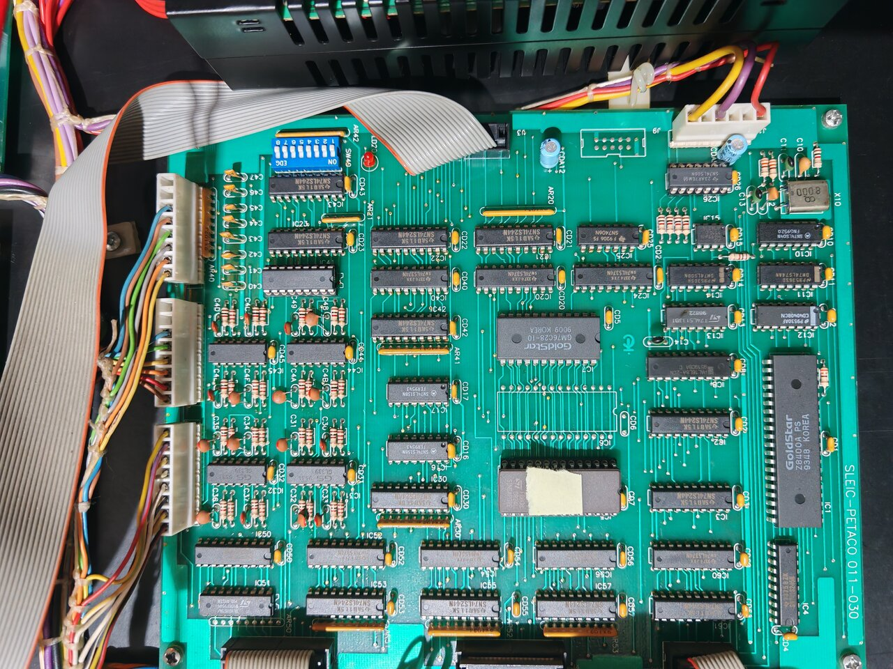

# 011-030A (8-bit / Z80 board) — IC inventory

[← Back to main README](../README.md)

  
   
  <em>011-030A — 8-bit / Z80 I/O board. Click the image for the full 4096 × 3072 photograph.</em>

This is the complete list of integrated circuits populated on the IO Moon Z80 / I/O board (silkscreen `011-030A`), together with the function of each part. Identifications are based on direct readout of the chip top-marks plus public datasheets for the part numbers.

The 16-bit / 80188 board (`011-029A`) is documented separately in [`board_011-029A_ics.md`](board_011-029A_ics.md).

## Summary by function

| Group | ICs | Purpose |
|-------|-----|---------|
| CPU & memory | IC1, IC5, IC7 | Z80A CPU, 32 KB program ROM, 2 KB work RAM. |
| Address / I/O decode | IC8, IC16, IC17 | PAL chip-select decode plus two 74LS138 3-to-8 demuxes generating the per-peripheral selects for the Z80 memory and I/O ports 0x80–0x87. |
| Reset / watchdog | IC15, IC12, IC13 | Microprocessor supervisor (ADM699), 12-stage CMOS counter, 13-input NAND for terminal-count detect — together the hardware watchdog. |
| Bus glue | IC2, IC3, IC4, IC10, IC11, IC14 | Z80 address / data buffers, inverters and small flip-flop / NAND glue. |
| Output latches | IC20, IC24, IC40, IC50, IC52, IC54, IC56, IC60 | 74LS374 octal D flip-flops — lamp / solenoid / matrix-scan strobe registers written by the Z80 OUT instructions. |
| Input buffers | IC21, IC22, IC23, IC30, IC42, IC43, IC53, IC55, IC57, IC61 | 74LS244 octal buffers — switch matrix return, direct switches, DIP switches, driver status. |
| Open-collector drivers | IC25, IC26 | 7406 / 74LS06 hex inverters with open-collector high-voltage outputs for off-board signalling. |
| Power drivers | IC41, IC51 | ULN2803 Darlington arrays driving lamp / solenoid loads off the connector ribbons. |
| Analogue level sensing | IC31, IC32, IC44, IC45 | LM339-class quad voltage comparators reading switch returns / driver status with hysteresis. |

## Full IC list

| IC | Part | Package | Function |
|----|------|---------|----------|
| IC1  | Goldstar Z8400A PS           | PDIP-40 | Z80A 8-bit CPU. Drives switch / lamp / solenoid I/O, the OKI MSM6376 sound playback (via ports 0x80 / 0x81 forwarded to the 16-bit board), and the shared-RAM mailbox with the 80188. |
| IC2  | TI SN74LS244N                | PDIP-20 | Octal buffer / line driver, 3-state. Address / data bus buffer toward J3 (inter-board ribbon). |
| IC3  | TI SN74LS244N                | PDIP-20 | Octal buffer / line driver, 3-state. |
| IC4  | TI SN74LS245N                | PDIP-20 | Octal bus transceiver, 3-state. Data-bus buffer between the Z80 and the rest of the board. |
| IC5  | EPROM 27C256                 | PDIP-28 | Z80 program ROM (`1005 v1.2`, 32 KB). Maps to `0x0000`–`0x7FFF`. |
| IC7  | Goldstar GM76C28-10          | PDIP-24 | 2 K × 8 CMOS SRAM, 100 ns. Z80 working RAM at `0xC000`–`0xC7FF`. |
| IC8  | AMD PAL16L8A-2CN             | PDIP-20 | Programmable Array Logic — Z80 memory / I/O chip-select decode and inter-CPU bus glue. **Undumped** (see [`chips_to_dump.md`](chips_to_dump.md)). |
| IC10 | TI SN74LS04N                 | PDIP-14 | Hex inverter. |
| IC11 | National DM74LS74AN          | PDIP-14 | Dual D-type positive-edge-triggered flip-flop with preset / clear. |
| IC12 | National CD4040BCN           | PDIP-16 | 12-stage CMOS ripple-carry binary counter. Watchdog timer — incremented continuously, periodically reset by the Z80 to prevent overflow. |
| IC13 | SGS T74LS133B1               | PDIP-16 | Single 13-input NAND gate. Decodes the watchdog counter's terminal count: when all 13 inputs are high, the NAND output drops and triggers a reset via IC15. |
| IC14 | National DM74LS00N           | PDIP-14 | Quad 2-input NAND gate. |
| IC15 | Analog Devices ADM699AN      | DIP-8   | Microprocessor supervisor: power-on reset, brownout detect, watchdog timeout input. Pin- and function-compatible with the Maxim MAX699. |
| IC16 | TI SN74LS138N                | PDIP-16 | 3-to-8 line decoder / demultiplexer. Generates I/O port chip-selects for the Z80 OUT-strobes (ports 0x80–0x87). |
| IC17 | TI SN74LS138N                | PDIP-16 | 3-to-8 line decoder / demultiplexer. Additional memory / peripheral select decode. |
| IC20 | TI SN74LS374N                | PDIP-20 | Octal D-type flip-flop with 3-state outputs. Output latch — one of the lamp / solenoid / scan registers. |
| IC21 | TI SN74LS244N                | PDIP-20 | Octal buffer / line driver, 3-state. Switch return / status read buffer. |
| IC22 | TI SN74LS244N                | PDIP-20 | Octal buffer / line driver, 3-state. |
| IC23 | TI SN74LS244N                | PDIP-20 | Octal buffer / line driver, 3-state. |
| IC24 | TI SN74LS374N                | PDIP-20 | Octal D-type flip-flop, 3-state. Output latch. |
| IC25 | TI SN7406N                   | PDIP-14 | Hex inverter buffer / driver with open-collector high-voltage outputs (30 V). |
| IC26 | TI SN74LS06N                 | PDIP-14 | Hex inverter buffer / driver with open-collector high-voltage outputs (LS variant). |
| IC30 | TI SN74LS244N                | PDIP-20 | Octal buffer / line driver, 3-state. |
| IC31 | Goldstar GL339               | PDIP-14 | Quad voltage comparator (LM339-class) with open-collector outputs. Switch return / driver status level sensing. |
| IC32 | Goldstar GL339               | PDIP-14 | Quad voltage comparator. |
| IC40 | TI SN74LS374N                | PDIP-20 | Octal D-type flip-flop, 3-state. Output latch. |
| IC41 | Toshiba ULN2803G             | PDIP-18 | 8-channel Darlington transistor array (50 V / 500 mA per channel). Lamp / solenoid current driver. |
| IC42 | TI SN74LS244N                | PDIP-20 | Octal buffer / line driver, 3-state. |
| IC43 | TI SN74LS244N                | PDIP-20 | Octal buffer / line driver, 3-state. |
| IC44 | Goldstar GL339               | PDIP-14 | Quad voltage comparator. |
| IC45 | Goldstar GL339               | PDIP-14 | Quad voltage comparator. |
| IC50 | TI SN74LS374N                | PDIP-20 | Octal D-type flip-flop, 3-state. Output latch. |
| IC51 | Allegro ULN2803A             | PDIP-18 | 8-channel Darlington transistor array. Second lamp / solenoid current driver. |
| IC52 | TI SN74LS374N                | PDIP-20 | Octal D-type flip-flop, 3-state. Output latch. |
| IC53 | TI SN74LS244N                | PDIP-20 | Octal buffer / line driver, 3-state. |
| IC54 | TI SN74LS374N                | PDIP-20 | Octal D-type flip-flop, 3-state. Output latch. |
| IC55 | TI SN74LS244N                | PDIP-20 | Octal buffer / line driver, 3-state. |
| IC56 | TI SN74LS374N                | PDIP-20 | Octal D-type flip-flop, 3-state. Output latch. |
| IC57 | TI SN74LS244N                | PDIP-20 | Octal buffer / line driver, 3-state. |
| IC60 | TI SN74LS374N                | PDIP-20 | Octal D-type flip-flop, 3-state. Output latch. |
| IC61 | TI SN74LS244N                | PDIP-20 | Octal buffer / line driver, 3-state. |

Eight 74LS374 latches × 8 bits = 64 bits of output across lamps, solenoids and matrix-scan strobes. Twelve 74LS244 buffers × 8 bits = 96 bits of input across the switch matrix, DIP switches, direct switches and driver-status returns.

## Programmable parts (firmware status)

| IC  | Part            | Status                                                |
|-----|-----------------|-------------------------------------------------------|
| IC5 | EPROM 27C256    | Archived as `v1_3_05.bin` in [`../roms/1.3 IPDB latest/`](../roms/1.3%20IPDB%20latest/). |
| IC8 | PAL16L8A-2CN    | **Undumped.** See [`chips_to_dump.md`](chips_to_dump.md). |

The Z80 disassembly references `0x8000`–`0xBFFF` as "extended routines/data" and labels the position `IC6` as "not included" in the dump set. The inspected board carries no IC6 chip at that position — the socket is either vacant or absent on this revision.
