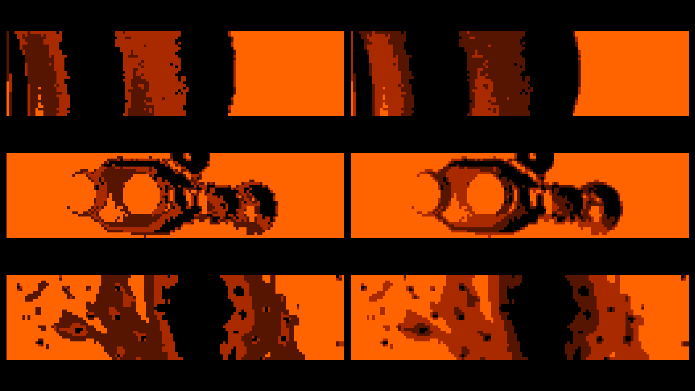

# DMD Graphics System

[← Back to main README](../README.md)

## Display Specifications

| Property | Value |
|----------|-------|
| Panel | 128 × 32 gas plasma dot matrix (board `011-022`) |
| Color depth | 2-bit (4 brightness levels, time-multiplexed) |
| Bitplanes | 2 (combined for 4 shades) |
| Display coprocessor | **Microchip PIC 16C57-HS/P** at IC23 on the CPU 16-bit board (`011-029A`) |
| Display buffer | `7000:0000`–`7000:03FF` in the 80188's address space (MCS3) |
| Panel power supply | 95 V AC / 58 V AC (connectors TW3–TW6, board `011-023`) |

> The PIC at IC23 is the DMD rasterizer, and it is a **free-running** one: it has
> no command interface, samples no data port, and exchanges no byte with the
> 80188 in either direction. It walks the video-RAM address over the 1 KB display
> buffer and sequences the panel's row/latch/frame strobes; the panel simply shows
> whatever stands in that buffer when the raster reaches it. Its 150 programmed
> words are disassembled in
> [`../asm/pic16c57_annotated.asm`](../asm/pic16c57_annotated.asm). The service
> manual (section 7.2.1 / page 92) describes it as "ayudado en las funciones del
> display por otro de 8 bits PIC 16C54HS"; the part actually fitted, and dumped,
> is a PIC16C57-HS/P.

---

## The frame pipeline

The 80188 composes every frame in its own work RAM and ends with a plain copy
into the 1 KB display buffer at segment `7000`, which is all the panel ever sees.
Everything is 128×32 two-plane: 16 bytes per row × 32 rows = 512 bytes per plane.
This is finding **F13** of [`findings.md`](../asm/baseline-2026-09/findings.md).

```
4000:0000-01FF  sprite / foreground plane 0   \ cleared by sub_F00C4
4000:0200-03FF  sprite / foreground plane 1   /
4000:0400-05FF  mask, one plane                 (0xFF = pass-all)
4000:0600-07FF  background plane 0            \ where the animation loader lands its frames
4000:0800-09FF  background plane 1            /
4000:0A00-0BFF  composite plane 0             \ the blit source
4000:0C00-0DFF  composite plane 1             /
7000:0000-01FF  display plane 0               \ what the PIC rasters
7000:0200-03FF  display plane 1               /
```

**Composite** (`sub_F08A5`) computes `(background AND mask) OR sprite` for both
planes, 32 rows × 16 bytes. **Blit** (`sub_F08EB`) copies `4000:0C00` → `7000:0200`
and `4000:0A00` → `7000:0000`. The two are the alternating branches of the INT0
ISR at `D000:0343` — `[4000:1142]` toggles on entry, the even branch blits and
dispatches animation, the odd branch composites and ticks the FM player — so the
display buffer is refreshed at INT0/2.

**There is no frame strobe and no double buffering.** PCS4 `0xA0200` bit 3 — the
one candidate for a "swap buffers" pulse — is written exactly once in the entire
ROM, by `pcs4_bit3_strobe` `D00FA`, called only from `boot_init`. The PIC is a
free-running raster with no command interface, so it displays whatever stands in
`7000:0000`–`03FF` at the moment it scans it. A sample can therefore catch a blit
in progress and show one plane a frame ahead of the other; the real panel has the
same race for the same reason.

**Nothing in this path inverts.** The firmware ANDs, ORs and copies these bytes
and never NOTs or XORs them.

The registers the 80188 writes in segment `A000h` are **not** DMD registers:
`A000h` is the peripheral chip-select block, carrying the J1 byte-port latches
and both sound chips. The boot values `sub_D00B9` writes there — PCS0 `0x28`,
PCS6 `0x80`, PCS4 `0x07` — are the idle levels of those, not display controls.
See [`80188_config.md`](80188_config.md).

Two more routines in the F-segment clear the display buffer at boot:
`0xF0113` and `0xF0124` (`ES=7000h, DI=0, CX=0x400, AL=0; REP STOSB`), whatever
names the older generated listings gave them.

---

## Animated Frame Format

The ROM contains **400 animated frames** stored sequentially in ROM2 (`0x00000`–`0x6F974`). Each frame is 1030 bytes:

### Header (6 bytes)

```
Bytes 0-1: 0x0020  — rows (32)
Bytes 2-3: 0x0010  — bytes per row (16 = 128 pixels / 8)
Bytes 4-5: 0x0200  — plane stride (512 = one plane)
```

Three little-endian words, and they are exactly the fields `anim_stream_open`
(`0xF0348`) reads into `[4000:1102]`, `[1104]` and `[1106]` before
`sub_F036D` copies the two planes into the background buffers. Every populated
64 KB page of `V1 3_02.bin` begins with the identical triple.

### Data (1024 bytes)

Two consecutive 512-byte bitplanes:

```
Offset 0x006 – 0x205: Plane 0 (512 bytes: 16 bytes/row × 32 rows)
Offset 0x206 – 0x405: Plane 1 (512 bytes: 16 bytes/row × 32 rows)
```

### Pixel Encoding

Each pixel value is computed from the two bitplanes:

```
pixel_value = (2 × plane0_bit) + plane1_bit
```

| Value | Plane 0 (MSB ×2) | Plane 1 (LSB ×1) | Appearance |
|-------|------------------|-------------------|------------|
| 0 | 0 | 0 | Off (black) |
| 1 | 0 | 1 | Dim |
| 2 | 1 | 0 | Medium |
| 3 | 1 | 1 | Bright (full) |

**Plane 0 is the MSB**, and three independent things say so:

1. The PIC's own raster program holds each row of the plane it scans first for
   **200** delay iterations against **30** for the second — a 6.7:1 duty ratio —
   and it scans `7000:0000`–`01FF` first
   ([`../asm/pic16c57_annotated.asm`](../asm/pic16c57_annotated.asm)).
2. The PPUC `dmdreader` Sleic decoder shifts wire plane 0 left by one and wire
   plane 1 by zero (see [`dmd_wire_protocol.md`](dmd_wire_protocol.md)), and it
   is confirmed working on a real IO Moon machine.
3. Rendered frames: the moon disc's anti-aliased edge ramps level 1 → 2 → 3 from
   outside in, and the service menu draws unselected items in plane 1 alone and
   the selected item in both planes — dim against bright only with plane 1 as the
   LSB.



### Bit polarity: a set bit is lit

A `1` bit is a **lit** pixel, throughout: in the ROM frame data, in the work-RAM
pipeline, in the display buffer and on the wire. The firmware applies no
inversion anywhere between the graphics ROM and `7000:0000`, and rendering ROM
frames with `1` = lit produces coherent images (frame 120 of `V1 3_02.bin`, for
instance, is a clean lunar disc), while the inverted reading produces a
full-screen lit rectangle with a hole in it.

> ⚠️ `scripts/dmd_viewer.py` does not use this convention by default. It inverts
> (`--no-invert` turns that off) and it weights the planes the other way round —
> `decode_frame()` computes `p0_bit + 2 * p1_bit` where the panel computes
> `2 * p0_bit + p1_bit`. The two differences do not cancel: composed, the default
> output has levels **0 and 3 swapped** (off renders as full-bright and vice
> versa), with levels 1 and 2 passing through. See
> [`dmd_viewer.md`](dmd_viewer.md) for the truth table. Its static-screen and
> font rendering is single-bitplane and unaffected.

---

## DMD Signal Decoding

The DMD data signals are encoded such that a 2-bit-per-pixel frame can be perceived. The first plane, representing the most significant bit (MSB), is displayed for approximately 6.25 ms. The second plane, representing the least significant bit (LSB), is then displayed for approximately 1.87 ms.

Interestingly, the LSB plane contains an additional “garbage” row of data at row 33. Since the display itself only has 32 rows, this extra row is ignored by the hardware and effectively discarded.

After the LSB plane is processed and the garbage row is thrown out, the display remains blank for roughly 5.64 ms before the next frame begins, again starting with the MSB plane.

Based on these observations, several conclusions can be drawn. All timing and signal information described above was obtained using a logic analyzer capture, available [here.](https://github.com/PPUC/dmdreader/tree/ppuc/logicanalyzer/Sleic)


### DMD Signal Summary

| FPS          | Pattern                 | Brightness split   |
|--------------|-------------------------|--------------------|
| 72 (13.85ms) | 2 plane MSB + LSB merge | 0%, 23%, 76%, 100% |

Interesting notes:

- Sleic has an unusual brightness split. Other manufacturers such as Bally / Williams and Data East / Sega implement 2bpp brightness levels as `0%, 33%, 67%, 100%`, which is far more logical.
- Only one other system appears to handle DMD signaling in a similar way: the Spike 1 system introduced in 2015. Unlike Sleic, which combines two planes to produce a 2bpp frame, the Spike 1 system combines four planes to produce a 4bpp frame. 
   - Important to mention here is that Sleic handles the MSB plane first, Spike handles LSB first. So Sleic is unique at that.
- Very unusual compared to the other manufacturers: Sleic appears to blank the DMD after every MSB + LSB cycle (approximately 8.12 ms) for an additional ~5.64 ms, resulting in a total frame time of roughly 13.85 ms. During this 5.64 ms interval, no activity is present on any signal line. In theory, this idle period could have been used to achieve a higher refresh rate, but Sleic clearly chose not to do so. 

---

## Static Screens

**274 static screens** are stored in ROM1 (`0x82000`–`0xC0000`). These are used for text displays: game messages, score labels, player names, etc.

### Format

Static screens are stored in **bilingual pairs** sharing a single header:

```
Header (6 bytes) → English bitmap (512 bytes) → Spanish bitmap (512 bytes)
```

Each bitmap uses **1 bitplane** only (on/off, no brightness levels), with a set bit lit — the same polarity as the animated frames, and as everything else in the display path.

Which of the two paired bitmaps is shown is selected by the language byte
`[4000:1001]`: **`== 5` ⇒ Spanish (second bitmap), any other value ⇒ English (first
bitmap)** — the default is `0x04` (English). This polarity is DMD-verified; see
[`iomoon_language_and_service_menu.md`](iomoon_language_and_service_menu.md).

### Content Examples

The identified static screens include game messages in both Spanish and English, such as score labels, mode indicators (MOONLIGHT, SUNSHINE, STARWAY), bonus displays, and system messages (TILT, credits).

---

## Scrolling Credits

The credits animation data occupies the range `0xA9D00`–`0xAC000` of the combined
`ROM2 + ROM1` image (= ROM1 file offset `0x29D00`–`0x2C000`). Unlike the static screens, credits are stored as a **continuous vertical strip** that scrolls upward during the attract mode credits sequence.

The `dmd_viewer.py` script extracts **42 individual text elements** from this strip by detecting content boundaries (rows with at least some lit pixels, grouped into elements with a minimum height of 5 rows).

The credits screens identify the development team:

- **Software**: Luis J. Gosálbez, Toñi Hernandez
- **Hardware**: Santos Aranda, Luis J. Gosálbez
- **Electromechanics**: Toñi Hernandez, J. Manuel Vázquez

---

## Font System

The ROM contains **131 font glyphs** stored in the range `0xA0000`–`0xB0000`. Glyphs come in multiple sizes:

| Size | Pixel Height | Usage |
|------|-------------|-------|
| 9 px | 9 pixels | Small text (labels, status) |
| 10 px | 10 pixels | Extra large characters |
| 12 px | 12 pixels | Large text (scores, headings) |
| 12 px | 12 pixels | 7-segment style digits |

### Font Entry Structure

Each glyph has a 6-byte header followed by 2 copies of the bitmap data:

```
Header: [height, 0x00, 0x01, 0x00, height, 0x00]
Data:   [height bytes] × 2 (two copies of the glyph bitmap)
```

All glyphs are **8 pixels wide**. Each byte in the glyph data represents one row of 8 pixels.

### Character Mapping

The font entries map to characters as follows:

- Entries 0–9 (9px): Digits `0`–`9`
- Entry 10 (9px): Space
- Entries 11–37 (9px): Letters `A`–`Z` and `Ñ`
- Entries 38–51 (9px): Punctuation and symbols
- Entries 52–61 (12px): Digits `0`–`9` (large)
- Entry 62 (12px): Space
- Entries 63–89 (12px): Letters `A`–`Z` and `Ñ` (large)
- Entries 90–104 (12px): Punctuation and symbols
- Entries 105–125 (12px): 7-segment style digits

### Custom Text Encoding

The 80188 game code uses a **custom character encoding** for DMD text, not standard ASCII:

```
0x0A = space    0x0B = 'A'    0x0C = 'B'    0x0D = 'C'    0x0E = 'D'
0x0F = 'E'      0x10 = 'F'    0x11 = 'G'    0x12 = 'H'    0x13 = 'I'
0x14 = 'J'      0x15 = 'K'    0x16 = 'L'    0x17 = 'M'    0x18 = 'N'
0x19 = 'Ñ'      0x1A = 'O'    0x1B = 'P'    0x1C = 'Q'    0x1D = 'R'
0x1E = 'S'      0x1F = 'T'    0x20 = 'U'    0x21 = 'V'    0x22 = 'W'
0x23 = 'X'      0x24 = 'Y'    0x25 = 'Z'
0x2C = ','      0x2E = '.'    0x2F = newline  0x00 = terminator
```

A **character mapping table** at ROM offset `0x809B0` (96 bytes) maps ASCII codes `0x20`–`0x7F` to glyph indices.

---

## Memory layout summary

Offsets into the **combined `ROM2 + ROM1`** image the tooling uses
(`cat "V1 3_02.bin" "V1 3_01.bin" > io_moon_combined.bin`), which is not the
80188's address space — see [`hardware_architecture.md`](hardware_architecture.md)
for the three windows the CPU actually sees.

```
0x00000 – 0x6F974 : ROM2: animated DMD frames (400 x 1030 bytes, seven 64 KB pages)
0x70000 – 0x7FFFF : ROM2 page 7, blank
0x80000 – 0x800FF : ROM1: the resident 80188 interrupt vector table
0x80100 – 0x808D3 : ROM1: service-menu records — 38 x 46-byte records twice over,
                    English at ROM1 offset 0x00100-0x007D3 and Spanish at
                    0x00D08-0x0013DB (80188 flat addresses, via LMCS)
0x808D4 – 0x809AF : ROM1: further tables in the LMCS window
0x809B0 – 0x80A0F : Character mapping table (ASCII -> glyph index)
0x82000 – 0xA0000 : Static screens (bilingual pairs)
0xA0000 – 0xA1100 : Font glyphs (131 entries)
0xA9D00 – 0xAC000 : Scrolling credits animation data
0xC0000 – 0xFFFFF : ROM1: 80188 program code (segments D000/E000/F000 + boot stub)
```
