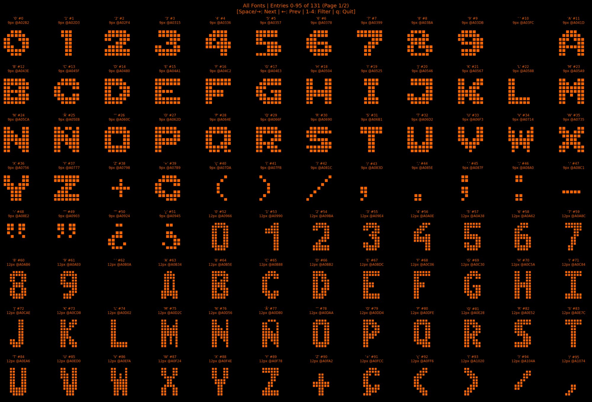
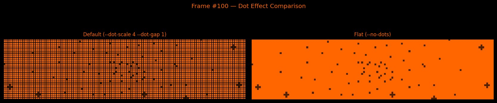
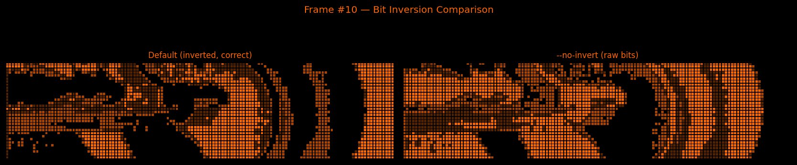
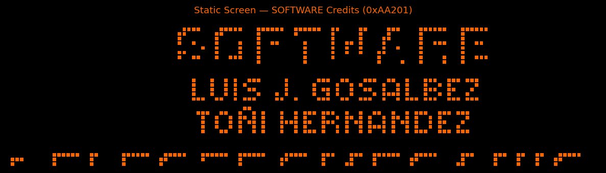

# DMD Viewer — `dmd_viewer.py`

[← Back to main README](../README.md)

<p align="center">
  
</p>

## Overview

`dmd_viewer.py` is a Python tool for viewing, analyzing, and exporting DMD (Dot Matrix Display) graphics from the SLEIC IO Moon pinball ROM. The IO Moon uses a **128×32 pixel monochrome DMD** with **4 brightness levels**, driven by an Intel 80188 CPU.

The script can decode the following types of graphical data from the ROM:

| Type | Count | Format | ROM Location |
|------|-------|--------|--------------|
| Animated frames | 400 | 2 bitplanes, 1030 bytes (6-byte header + 1024 data) | `0x00000`–`0x6F974` |
| Static screens | 274 | 1 bitplane, 512 bytes per bitmap | `0x82000`–`0xC0000` |
| Credits screens | 42 | 1 bitplane, variable height | `0xA9D00`–`0xAC000` |
| Font glyphs | 131 | 1 bitplane, 8px wide, 9–12px tall | `0xA0000`–`0xB0000` |
| Known screens | 35 | Named static screens with descriptions | Spread across ROM1 |

All graphics are rendered with authentic DMD orange colors and a dot matrix effect that simulates the physical appearance of a real DMD panel.

---

## Requirements

```bash
pip install matplotlib numpy
```

For interactive windows (animations, pagination):

```bash
pip install PyQt5    # or use Tk (often bundled with Python)
```

---

## ROM File Preparation

The script expects a **combined ROM file** of exactly **1,048,576 bytes** (1 MB):

- **ROM2** (`0x00000`–`0x7FFFF`): 512 KB DMD graphics (animated frames)
- **ROM1** (`0x80000`–`0xFFFFF`): 512 KB code + static graphics + fonts

If you have two separate ROM chips:

```bash
cat "V1 3_02.BIN" "V1 3_01.BIN" > io_moon_combined.bin
```

---

## Quick Start

```bash
# List all animated frames (terminal output)
python3 dmd_viewer.py -r io_moon_combined.bin --index

# View a single animated frame
python3 dmd_viewer.py -r io_moon_combined.bin --frame 50

# View animated frames in a paginated grid
python3 dmd_viewer.py -r io_moon_combined.bin --grid

# Play all frames as an animation
python3 dmd_viewer.py -r io_moon_combined.bin --show-all --interval 50

# Export a frame to PNG
python3 dmd_viewer.py -r io_moon_combined.bin --export 50 frame50.png
```

---

## Command Reference

### Index Listings (terminal output)

```bash
--index             # List all animated frames with offsets
--static-index      # List all detected static screens
--known             # List named/identified static screens
--credits-index     # List scrolling credits elements
```

### Viewing Individual Frames

```bash
--frame N                          # View animated frame #N (0-399)
--static N                         # View static screen #N by index
--offset 0xAA201 --static-offset   # View a static screen at a specific ROM address
```

### Grid Views (paginated)

```bash
--grid                   # Animated frames in a paginated grid
--static-grid            # Static screens in a paginated grid
--credits-grid           # Scrolling credits in a paginated grid
--known-grid             # Named/identified static screens in a grid
--fonts                  # Font glyph viewer with filtering
```

<p align="center">
  
</p>

### Playing Animations

```bash
--show-all               # Play all animated frames sequentially
--interval N             # Set playback interval in ms (default: 200)
--loop                   # Use manual loop for animation (more reliable on some systems)
```

### Exporting to PNG

```bash
--export FRAME FILE      # Export frame N to a PNG file
--export-all DIR         # Export all animated frames to a directory
```

---

## Display Options

### Dot Matrix Effect

By default, the viewer renders each pixel as a scaled dot with a dark gap, simulating the physical appearance of a real DMD panel.

```bash
--dot-scale N            # Dot size in output pixels (default: 4, 1=no upscale)
--dot-gap N              # Dark gap between dots in pixels (default: 1, 0=no gap)
--no-dots                # Disable dot effect (flat pixel rendering)
```

<p align="center">
  
</p>

### Bit Inversion

The IO Moon stores DMD frame data with **inverted bits** (0 = lit, 1 = off). The viewer inverts by default for correct display. Use `--no-invert` to see the raw bit pattern.

<p align="center">
  
</p>

### Grid Dimensions

```bash
--rows N --cols N        # Grid size (default: 4×8 = 32 per page)
--no-paginate            # Show only first page without navigation
```

---

## Keyboard Navigation

All paginated views support the same keyboard controls:

| Key | Action |
|-----|--------|
| `Space`, `→`, `n` | Next page |
| `Backspace`, `←`, `p` | Previous page |
| `Home` | First page |
| `End` | Last page |
| `q` | Close window |

The font viewer has additional filter keys:

| Key | Filter |
|-----|--------|
| `1` | All fonts |
| `2` | Small (9px) |
| `3` | Large (12px) |
| `4` | 7-segment |

---

## Technical Background

### DMD Hardware

The display is driven by the 80188 via memory-mapped registers at segment `A000h`:

| Register | Address | Function |
|----------|---------|----------|
| Control 1 | `A000:0000` | DMD control (`0x28` = display on) |
| Control 2 | `A000:0080` | Secondary control |
| Mode | `A000:0200` | Mode register (bit 3 = strobe) |
| Enable | `A000:0300` | Enable register (`0x80` = enabled) |

### 4-Level Brightness

The 4 brightness levels are achieved by combining two bitplanes:

| Value | Plane 0 | Plane 1 | Brightness | Viewer Color |
|-------|---------|---------|------------|--------------|
| 0 | off | off | Off | `#000000` (black) |
| 1 | on | off | Dim | `#552200` (dark orange) |
| 2 | off | on | Medium | `#AA4400` (medium orange) |
| 3 | on | on | Full | `#FF6600` (bright orange) |

### Animated Frame Format

Each animated frame occupies 1030 bytes:

```
Offset  Size  Description
------  ----  -----------
0x00    6     Header: 20 00 10 00 00 02
              (height=32, 0, width_bytes=16, 0, 0, planes=2)
0x06    512   Bitplane 0 (16 bytes/row × 32 rows)
0x206   512   Bitplane 1 (16 bytes/row × 32 rows)
```

Data is stored with **inverted bits**: a `0` bit means the pixel is lit, and a `1` bit means it is off. This was confirmed by visual comparison with actual DMD output.

### Static Screen Format

Static screens are stored in pairs (English + Spanish) with the same 6-byte header:

```
Header (6 bytes) → Bitmap 1 / English (512 bytes) → Bitmap 2 / Spanish (512 bytes)
```

Static screens use 1 bitplane only (on/off, no brightness levels) and are **not** bit-inverted.

### Detection Algorithms

- **Animated frames**: Found by scanning for the header pattern `20 00 10 00 00 02` in ROM2 (`0x00000`–`0x80000`).
- **Static screens**: Found by scanning for the same header in ROM1 (`0x82000`–`0xC0000`), filtered by pixel count (50–3500 lit pixels).
- **Credits**: Extracted from the contiguous range `0xA9D00`–`0xAC000` by grouping rows with content into elements.
- **Fonts**: Found by scanning for 6-byte entry headers matching `[h, 00, 01, 00, h, 00]` where `h ∈ {9, 10, 11, 12}`.

---

## Known Limitations

- **No audio**: The script only decodes graphical data. Use [`extract-oki-msm6376.py`](extract_oki_msm6376.md) for sound extraction.
- **Interactive backend required**: Animations and paginated views require an interactive matplotlib backend (TkAgg, Qt5Agg, etc.). On headless systems, only export mode works.
- **Static screen detection is heuristic**: Not all static screens may be detected. Use `--offset ADDR --static-offset` to manually inspect specific addresses.
- **Credits cropping**: Credits elements taller than 32 rows are cropped for display. The first element (55 rows) loses its bottom rows.
---

## Example Output

### Static Screen (Software Credits)

<p align="center">
  
</p>

### Animated Frame Grid (Page 1 of 13)

<p align="center">
  
</p>
