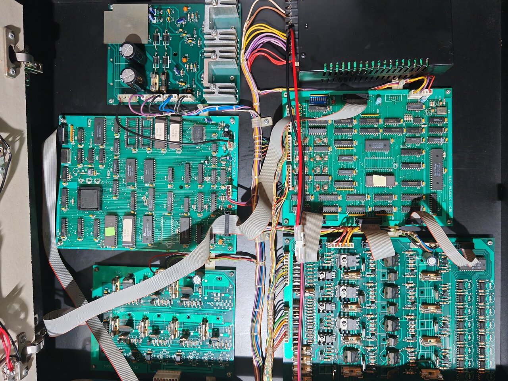
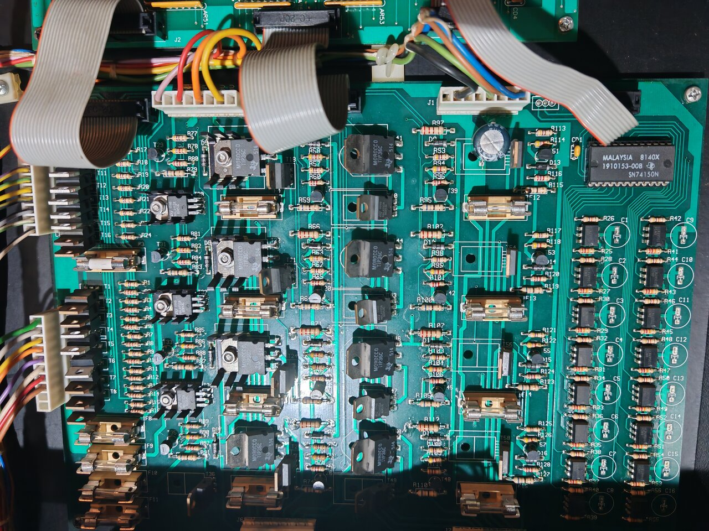
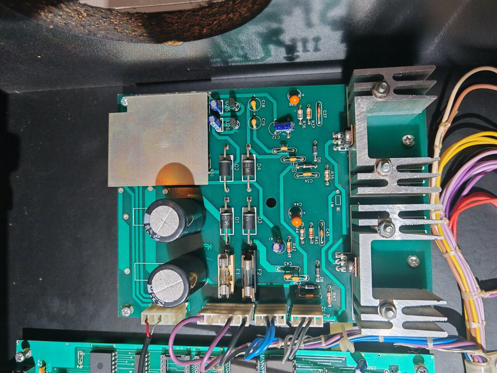

# Hardware Architecture

[← Back to main README](../README.md)

> Offline datasheets for every IC named in this document are catalogued in
> [`../datasheets/`](../datasheets/README.md) and linked per-chip from the board IC
> inventories ([16-bit board](board_011-029A_ics.md), [Z80 board](board_011-030A_ics.md)).

<p align="center">
  <a href="../images/overview_backbox_all_boards.jpg" target="_blank" rel="noopener">
    
  </a>
  <br>
  <em>The IO Moon backbox with all boards in situ. Click the image for the full 4096 × 3072 photograph.</em>
</p>

## General Specifications

| Property | Value |
|----------|-------|
| Manufacturer | SLEIC — Creaciones e Investigaciones Electrónicas, S.L. |
| Location | Av. Valdelaparra 3, Pol. Ind. Alcobendas, 28100 Madrid, Spain |
| Year | 1994 — the ROM's own copyright block, at `V1 3_01.bin` file offset `0x507A9`, reads `(C) SLEIC 1.994` and `(C) LUIS GOSALBEZ CARRASCO 1.994` (Spanish thousands notation) |
| Theme | Space exploration / Jupiter mission |

### Mechanical

- 3 Flippers (left, right, middle right)
- 5 Pop bumpers
- 5 Drop targets (bank A–E)
- 2 Ramps
- 2 Scoops / VUKs (Vertical Up Kickers)
- Jupiter ball lock mechanism

### Game Features

- MOONLIGHT, SUNSHINE, STARWAY game modes
- ORBITS letter spelling
- Monolith Messages (10 different awards)
- Multiball and Little Multiball
- Match/Lottery system
- 4-player support
- Bilingual: Spanish and English

---

## Board Inventory

From the service manual, section 7.1:

| Board | Designator | Function | Location |
|-------|-----------|----------|----------|
| C.P.U. 16 bits | `011-029A` | Control, Audio, Video | Head |
| C.P.U. 8 bits | `011-030A` | Lights, Solenoids, Switches | Head |
| Drivers | `011-027A` | Light & solenoid power drivers | Head |
| Audio amplifier | `011-024` | Audio power output | Head |
| Plasma display power | — | Display PSU | Head |
| Visualizador Plasma | `011-022` | The DMD itself (gas plasma panel) | Head |
| Plasma display power supply | `011-023` | Display HV PSU | Head |
| Light/Solenoid PSU | `011-028` | +24V/+44V supplies | Cabinet |
| Electronic coin mechanism | `N-50` | Coin entry | Door |

The DMD is a **gas plasma panel**, not an LED dot matrix — note the 95 V AC / 58 V AC supply requirement (connectors TW3–TW6).

### Driver board (`011-027A`) and audio amplifier (`011-024`)

<p align="center">
  <a href="../images/driver_board_sleic_011-027A.jpg" target="_blank" rel="noopener">
    
  </a>
  <br>
  <em>011-027A — light and solenoid power-driver board.</em>
</p>

<p align="center">
  <a href="../images/sound_amplifier_board_sleic_011-024.jpg" target="_blank" rel="noopener">
    
  </a>
  <br>
  <em>011-024 — audio power amplifier board.</em>
</p>

---

## CPU Boards

### Main CPU Board — 80188 (16-bit) — SLEIC-PETACO 011-029A

The 80188 board carries the main 16-bit CPU (`AMD N80C188-10`), the program / display EPROMs, the sound chips (Yamaha YM3812 OPL2 + OKI MSM6376 ADPCM), the 28C64A NVRAM, and a PIC 16C57 coprocessor that drives the DMD raster.

For the per-chip inventory — every IC populated on this board with its part number and function — see [`board_011-029A_ics.md`](board_011-029A_ics.md). The PAL at IC7 is undumped: see [`chips_to_dump.md`](chips_to_dump.md).

The YM3812's chip-select is **/PCS5** (an 80188 peripheral chip-select; sheet 011-029-07) = memory address `0xA0280` (index) / `0xA0281` (data). It is driven by the 80188 directly — not by the PIC and not through any queue: the IO Moon software plays **10 FM music tracks** through it. The write primitive is `D000:0D99`, the sequencer `D000:0D37` and the song table `CS:0DE5` (finding F8) — see [`iomoon_fm_extract.md`](iomoon_fm_extract.md) and [`ym3812_pinmame_precedents.md`](ym3812_pinmame_precedents.md).

#### Clocking

Neither ROM states any clock rate, so the figures below are inferred from the parts and the board and are flagged where that matters.

The 80188's CLKOUT is taken as **10 MHz** from OSC1: IC1 is an `N80C188-10`, and 10 MHz is what makes the boot table's timer-0 programming (max count `0x6276` at CLKOUT/4) come out at the 99.18 Hz the firmware's delay counters are written around. The `-10` is the part's speed *grade*, not a reading of the crystal, so this is an inference with a clean scale factor on everything timed from it.

The Z80 on board `011-030A` gets its periodic IRQ from a divider chain on the **16-bit** board: two cascaded `74LS393` dual counters (IC20, IC21) feeding a `74LS27` triple NOR (IC22), positioned next to OSC1, delivered to the Z80 board over the J3 ribbon. The chain yields 8 MHz ÷ 8192 = **977 Hz**, which matches the rate the Z80 firmware's lamp-refresh state machine implies in [`../research/z80_irq_timing.md`](../research/z80_irq_timing.md). The YM3812's φM (`YACLK`) and the OKI's clock (`OKCLK`) are taken off the same chain, as are the DMD raster clocks (DOTCLK, RCLK, COLLAT) fed to the PIC at IC23; the individual taps are read from the schematic net names rather than measured.

#### Board placement (from figure 7-1)

Approximate layout of board 011-029A as drawn in the manual's component-placement figure:

```
   Top-Left                                    Top-Right
   ─────────────────────────────────────────────────────────
   IC2  IC3  IC4  IC5  (20-pin latches)        IC8  OSC1   J2 (14-pin → display)
                                               IC22                  AR20  IC24
                                               IC21
                          IC1 (80188-10)       IC20      JP7  IC23   (← PIC 16C57)
                          68-pin PLCC          ────────────────────
                                               IC30  IC31  IC32  IC34   (glue logic row)
                                               IC33  IC55
   ─────────────────────────────────────────────────────────
   Bottom-Left                                 Bottom-Right
   IC10 (27C040, 1001 JUEGO)                   IC54  (32-pin DIP socket, vacant)
   IC11 (27C040, 1002 BANK)                    IC53  (27C040, 1004 SONIDO 2)
   IC12 (UM62256, main RAM)                    IC52  (27C040, 1003 SONIDO 1)
   IC13 (32-pin DIP socket, vacant)            IC56  IC50  IC44  IC45  IC43  IC46
   IC14 (28C64A NVRAM, 28-pin)                 IC60 (YM3812)   IC51 (OKI 6376, 42-pin)
   IC41  IC42 (drivers / latches, 20-pin)      IC61 (YM3014)   IC63 (X9C503P, 8-pin)
   AR40, J1 (20-pin → CPU 8-bit)                                  P50 (music balance trim)
```

IC13 and IC54 are unpopulated 32-pin DIP sockets — both are expansion options not used by IO Moon.

#### Connectors (manual section 7.2.1.2)

| Connector | Function |
|-----------|----------|
| J1 | Bus communication to CPU 8-bit board (20-pin ribbon, matches J3 on the 8-bit board) |
| J2 | Display interface (14-pin ribbon to the plasma display) |
| J3 | Audio output to amplifier (shielded mesh+active) |
| J4 | Power input (+5 V / GND) |

### Sound/Switch CPU Board — Z80 (8-bit) — SLEIC-PETACO 011-030A

The Z80 board carries the 8-bit I/O CPU (`Goldstar Z8400A PS`, a Z80A), its 32 KB program ROM (IC5) and 2 KB work RAM (Goldstar GM76C28-10 at IC7), the lamp / solenoid / switch-matrix latches and buffers, two ULN2803 Darlington arrays for current drive, four GL339 quad comparators for switch-return level sensing, a hardware watchdog (CD4040 counter + 74LS133 NAND + ADM699 supervisor) and a PAL16L8 at IC8 that does the Z80 memory and I/O decode.

For the per-chip inventory — every IC populated on this board with its part number and function — see [`board_011-030A_ics.md`](board_011-030A_ics.md). The PAL at IC8 is undumped: see [`chips_to_dump.md`](chips_to_dump.md).

The Z80 board itself does not generate its own periodic IRQ — the 977 Hz rate the firmware expects comes from the divider chain on the 16-bit board described above and reaches the Z80 through the J3 ribbon.

| Reference | Component | Notes |
|-----------|-----------|-------|
| SW40 | DIP switch block, 8-position | See DIP table below |
| X10  | 8 MHz crystal                | Board timing source. The Z80A at IC1 is a 4 MHz-grade part, so the CPU clock is a division of X10 rather than X10 itself; the divisor is not established from the ROM or the inventory. |

#### Connectors (manual section 7.2.2.2)

| Connector | Function |
|-----------|----------|
| J1 | Power input (+5 V / GND) |
| J2 | Lamp matrix driver output (20-pin ribbon) |
| J3 | Bus communication to CPU 16-bit board (20-pin ribbon, matches J1 on the 16-bit board) |
| J4 | Solenoid driver output (20-pin ribbon) |
| J5 | VDB (solenoid watchdog) supervision (10-pin) |
| J6 | Switch matrix column scan (SCAN) outputs |
| J7 | Direct switch inputs (flippers, START, coin, tilt, test) |
| J8 | Switch matrix row return (RET) inputs |

#### DIP Switch SW40

From service manual section 7.2.2.3:

| Switch | ON | OFF |
|--------|----|-----|
| SW1 | VDB solenoid watchdog **disabled** | VDB **enabled** |
| SW2–4 | Country code (see below) | — |
| SW5 | Service: no balls dispensed | Normal operation |
| SW6 | Service: solenoid test | Normal operation |
| SW7 | Service: lamp test | Normal operation |
| SW8 | Service: board self-test | Normal operation |

Country code (SW2–SW4 combination) with default coin values. The Z80 reports port `0x04`
on command `0xF9` (`2D9D`), the 80188 turns bits 1-3 into a country 0..7 (`D5CAC`-`D5CC2`,
dispatch table at `D5D01` with `CS = D2F2`), applies that country's coin preset
(`sub_D69CC`) and, at `D664D`, overwrites NVRAM `5040:01BF` → `[4000:1001]` whenever the
DIP disagrees with the stored value. The DIP therefore sets the coin values **and** the
display language (country 5 = Spanish). See
[`iomoon_language_and_service_menu.md`](iomoon_language_and_service_menu.md) §B.

The row order below is the country number 0..7 with **SW2 as the low bit and ON = 0**,
established from the presets themselves (`findings.md` F11); the ROM's values for the
France and Belgium rows do **not** match the coin values printed here.

| Country | SW2 | SW3 | SW4 | Default coin values |
|---------|-----|-----|-----|---------------------|
| United Kingdom (Inglaterra) | ON | ON | ON | 30p / 1, 50p / 2, £1 / 5 |
| France | OFF | ON | ON | 3 Fr / 1, 5 Fr / 2, 10 Fr / 5 |
| Germany | ON | OFF | ON | 1 DM / 1, 2 DM / 3, 5 DM / 8 |
| Italy | OFF | OFF | ON | 500 L / 1, 1000 L / 3, 2000 L / 7 |
| Netherlands (Holanda) | ON | ON | OFF | 1 Fl / 1, 2.5 Fl / 3, 5 Fl / 7 |
| Spain (España) | OFF | ON | OFF | 50 pts / 1, 100 pts / 3, 200 pts / 8, 500 pts / 18 |
| Belgium | ON | OFF | OFF | 20 BF / 1, 50 BF / 3, 100 BF / 7 |
| Portugal | OFF | OFF | OFF | 50 Esc / 1, 100 Esc / 3, 200 Esc / 7 |

---

## Memory Map

### ROM file layout

The two 27C040s hold, by file offset:

```
V1 3_01.bin  (IC10, "1001 JUEGO", ROM1) — 512 KB
  0x00000–0x000FF   the interrupt vector table (resident, see below)
  0x00100–0x3FFFF   menu records, fonts, static screens, credits, animation data
  0x40000–0x4FFFF   code segment D000 — main program
  0x50000–0x5FFFF   code segment E000 — extended code / data
  0x60000–0x7FEFF   code segment F000 — system code
  0x7FF00–0x7FFFF   boot stub + reset vector

V1 3_02.bin  (IC11, "1002 BANK", ROM2) — 512 KB
  0x00000–0x6FFFF   seven 64 KB pages of animated DMD frames
  0x70000–0x7FFFF   page 7, blank
```

The 2026-09 baseline decodes **29 810 instructions across 83 regions**
(≈88 KB) of ROM1; the rest of both images is graphics data and lookup tables.

### 80188 address space

The 80188 does **not** see the two ROMs flat. Three windows carry them
(finding F2, [`80188_config.md`](80188_config.md)):

| 80188 range | Contents |
|-------------|----------|
| `0x00000`–`0x3FFFF` (LMCS) | ROM1 file `0x00000`–`0x3FFFF`: the resident IVT at physical 0 followed by fonts, static screens and animation data. Not banked. |
| `0x60000`–`0x6FFFF` (MCS2) | **one 64 KB page of ROM2**, selected by PCS0 bits 0–2 (`sub_F00A0` at `F00A0`, 17 call sites pushing 0–6) |
| `0xC0000`–`0xFFFFF` (UMCS) | ROM1 file `0x40000`–`0x7FFFF`: all code, and the reset vector at `0xFFFF0` |

### 80188 segment map

| Segment | Linear Range | Function |
|---------|-------------|----------|
| `0000h`–`3000h` | `0x00000`–`0x3FFFF` | LMCS: IVT, menu records, fonts, static screens, animation data (ROM1 low half) |
| `4000h` | `0x40000` | Work RAM (80188-private; MCS0). DMD pipeline at `0000`–`0DFF`, link and player state at `1000`+ |
| `4130h` | `0x41300` | Game configuration (country number, balls per game, thresholds) |
| `4134h` | `0x41340` | Per-ball state (tilt warnings, …) |
| `4137h` | `0x41370` | Menu state (cursor `0013`, record-table far pointer `004B`) |
| `413Ch` | `0x413C0` | Game state variables — the most heavily referenced data area (switch-code shadow `00D6`, credits cache `00D4`, mode `014F`) |
| `4152h` | `0x41520` | Stack segment (SP init = `0x0205`) |
| `5040h` | `0x50400` | Non-volatile store window (MCS1), gated by PCS0 bits 3/4 |
| `6000h` | `0x60000` | Banked graphics page (MCS2) |
| `7000h` | `0x70000` | DMD staging buffer, `0000`–`03FF` (MCS3) |
| `A000h` | `0xA0000` | Peripheral chip-select block (PCS0–PCS6): the J1 latches, the OKI control latch and `/OKCS`, and the **YM3812 at /PCS5 = `0xA0280`/`0xA0281`** |
| `D000h` | `0xD0000` | Main program code |
| `E000h` | `0xE0000` | Extended code/data |
| `F000h` | `0xF0000` | System code |

### Z80 Memory Map

| Address Range | Size | Content |
|--------------|------|---------|
| `0x0000`–`0x7FFF` | 32 KB | ROM IC5 (27C256) — main Z80 program (`1005 v1.2`) |
| `0x8000`–`0xBFFF` | 16 KB | IC6 socket — vacant on the inspected board |
| `0xC000`–`0xC7FF` | 2 KB  | RAM IC7 (Goldstar GM76C28-10) — working memory |

`0x8000`–`0xBFFF` is the IC6 expansion-ROM window. Inspection of a real board confirms the IC6 socket is unpopulated, and no Z80 code reads that range, so the window is unused on this machine.

---

## Power Connectors

| Connector | Function |
|-----------|----------|
| TW1–TW2 | +24V / GND Flash Lights |
| TW3–TW6 | Display power (95V AC, 58V AC) |
| TW7–TW8 | +24V DC / GND Light Matrix |
| TW9–TW10 | 6.3V AC General Illumination |
| TW11–TW12 | +44V DC / GND Solenoids |
| TW13 | Protective wire |
| TW14–TW16 | Audio amplifier (±12V, 0V) |
| TW17–TW18 | AC mains (220V) |

---

## Inter-board cabling

The two CPU boards are linked by a single 20-pin ribbon between the **16-bit board J1** and the **8-bit board J3** (manual sections 7.2.1.2 and 7.2.2.2). This is the physical channel for the **J1 8-bit handshaken byte-port** between the two CPUs — there is no shared RAM and no address bus on J1; see [Inter-CPU Communication](inter_cpu_communication.md).

Switch matrix, lamp matrix, and solenoid drivers are all anchored on the 8-bit board (connectors J2, J4, J6, J7, J8). The 16-bit board has **no** direct switch-matrix or driver connections — all I/O passes through the Z80.
