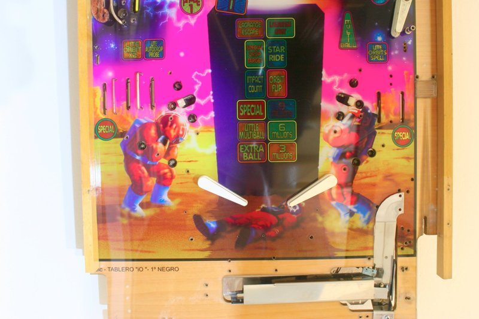

# Switch, Lamp & Solenoid Tables

[← Back to main README](../README.md)

The ports and codes below are read out of the Z80 ROM (`V1 3_05.bin`) in
[`../asm/baseline-2026-09/`](../asm/baseline-2026-09/); findings **F5**, **F7**,
**F15**, **F16**, **F17** and **F18** of
[`findings.md`](../asm/baseline-2026-09/findings.md) cover the switch-code map,
the port roles, ball handling, the firmware's own switch-code-to-contact table
and the driver-latch coil map, respectively. The switch and driver C-numbers
and names below are the firmware's own (F16, F17), cross-checked against the
original SLEIC IO Moon service manual; the lamp list is the manual's own
numbering. Where the ROM and the manual differ, the ROM is what runs and the
difference is called out.

> For how the service menu is opened and navigated, see
> [`iomoon_language_and_service_menu.md`](iomoon_language_and_service_menu.md):
> TEST (`0x3F`) opens and exits it, the flipper codes `0x41` and `0x42` scroll
> and select, and START (`0x40`) goes back.

---

## Switches

The Z80 delivers **48 matrix positions** (6 columns × 8 rows), **6 cabinet
inputs** on port `0x03`, and a further 16-way multiplexed **direct-input scan**
on port `0x87` / port `0x01` bit 5 that is disabled on this machine
(port `0x04` bit 0 gates `direct_input_scan` off). The manual's contact list
runs C1–C50.

### Cabinet inputs (port `0x03`)

Read directly, bypassing the matrix. The bit → code mapping is exact; the
C-number beside each is the manual's.

| Code | Port `0x03` bit | Spanish Name | English Name | Z80 handler |
|------|-----------------|--------------|--------------|-------------|
| `0x32` (`0x33` in test mode) | 5 | Entrada Monedas (C3) | Coin mechanism — one code per press | `0D3C` / `0D44` |
| `0x3E` | 0 | Contacto de falta (C20) | Tilt | `sub_125B` |
| `0x3F` | 1 | Pulsador de Test (C4) | TEST / service menu | `sub_1278` |
| `0x40` | 4 | Pulsador Start (C2) | START | `sub_1285` |
| `0x41` | 3 | Pulsador flipper izquierdo (C1) | Left flipper button | `sub_1292` |
| `0x42` | 2 | Pulsador flipper derecho (C5) | Right flipper button | `sub_12D8` |

The two flipper bits fire the port-`0x85` coil pairs directly (`sub_05C7` /
`sub_05ED`) and only emit `0x41` / `0x42` over J1 while test mode is set; the
other four emit their code on every press. `0x32` is the one code the 80188's
NMI does not queue — it counts it in `[4000:1144]` as a coin pulse instead.

### Matrix contacts

6 columns × 8 rows = 48 positions, strobed on port `0x82` (one-hot `0x01`–`0x20`)
and read back on port `0x02`. **Column c, bit b → code `0x0A + 8c + b`** for
c = 0..4, and **`0x34 + b`** for column 5.

Every one of the 44 matrix positions carries the firmware's own C-number and
name, in both languages — extracted from the ROM's own switch-code tables
(**F16**) rather than transcribed from the manual. Column 0 bits 0–3, codes
`0x0A`–`0x0D`, are the ball-handling contacts (**F15**): bits 0–2 the three
trough contacts and bit 3 the ball-exit contact. Contact 0 is the trough entry
and doubles as the ball-over sensor, reporting code `0x43` instead of its own
`0x0A`.

| Code | Column.bit | C# | English | Spanish |
|------|------------|----|---------|---------|
| `0x0A` | c0.0 | C6 | OUTHOLE 1 | SALIDA BOLAS 1 |
| `0x0B` | c0.1 | C7 | OUTHOLE 2 | SALIDA BOLAS 2 |
| `0x0C` | c0.2 | C8 | OUTHOLE 3 | SALIDA BOLAS 3 |
| `0x0D` | c0.3 | C9 | BALL OUT | BOLA FUERA |
| `0x0E` | c0.4 | C18 | LANE 5 | PASILLO 5 |
| `0x0F` | c0.5 | C17 | LANE 4 | PASILLO 4 |
| `0x10` | c0.6 | C11 | L.C.FLIPPER | C. FLIPPER IZQ. |
| `0x11` | c0.7 | C10 | R.C.FLIPPER | C. FLIPPER DER. |
| `0x12` | c1.0 | C22 | LANE 11 | PASILLO 11 |
| `0x13` | c1.1 | C21 | RAMP 1 EXIT | SALIDA RAMPA 1 |
| `0x14` | c1.2 | C19 | U.C.FLIPPER | C.FLIPPER SUP. |
| `0x15` | c1.3 | C16 | RIGHT SHOOTER | EXPULSOR DERECHO |
| `0x16` | c1.4 | C15 | LEFT SHOOTER | EXPULSOR IZQ. |
| `0x17` | c1.5 | C14 | LANE 3 | PASILLO 3 |
| `0x18` | c1.6 | C13 | LANE 2 | PASILLO 2 |
| `0x19` | c1.7 | C12 | LANE 1 | PASILLO 1 |
| `0x1A` | c2.0 | C24 | LANE 6 | PASILLO 6 |
| `0x1B` | c2.1 | C25 | BANK A | DIANA BANCADA A |
| `0x1C` | c2.2 | C26 | BANK B | DIANA BANCADA B |
| `0x1D` | c2.3 | C27 | BANK C | DIANA BANCADA C |
| `0x1E` | c2.4 | C28 | BANK D | DIANA BANCADA D |
| `0x1F` | c2.5 | C29 | BANK E | DIANA BANCADA E |
| `0x20` | c2.6 | C30 | INNER BANK | FONDO BANCADA |
| `0x21` | c2.7 | C31 | HOLE 2 | TRAGABOLAS 2 |
| `0x22` | c3.0 | C23 | HOLE 1 | TRAGABOLAS 1 |
| `0x23` | c3.1 | C33 | BUMPER 1 | BUMPER 1 |
| `0x24` | c3.2 | C32 | BULL EYE 1 | DIANA 1 |
| `0x25` | c3.3 | C35 | BUMPER 3 | BUMPER 3 |
| `0x26` | c3.4 | C34 | BUMPER 2 | BUMPER 2 |
| `0x27` | c3.5 | C37 | BUMPER 5 | BUMPER 5 |
| `0x28` | c3.6 | C36 | BUMPER 4 | BUMPER 4 |
| `0x29` | c3.7 | C40 | RAMP 1 ENTRANCE | ENTRADA RAMPA 1 |
| `0x2A` | c4.0 | C44 | JUPITER 1 | JUPITER 1 |
| `0x2B` | c4.1 | C45 | JUPITER 2 | JUPITER 2 |
| `0x2C` | c4.2 | C46 | JUPITER 3 | JUPITER 3 |
| `0x2D` | c4.3 | C39 | RAMP 2 ENTRANCE | ENTRADA RAMPA 2 |
| `0x2E` | c4.4 | C38 | BULL EYE 2 | DIANA 2 |
| `0x2F` | c4.5 | C48 | LANE 10 | PASILLO 10 |
| `0x30` | c4.6 | C49 | RAMP 1 MIDDLE | MEDIA RAMPA 1 |
| `0x31` | c4.7 | C50 | ENTRADA JUPITER | ENTRADA JUPITER |
| `0x34` | c5.0 | C47 | RAMP 2 EXIT | SALIDA RAMPA 2 |
| `0x35` | c5.1 | C43 | LANE 9 | PASILLO 9 |
| `0x36` | c5.2 | C42 | LANE 8 | PASILLO 8 |
| `0x37` | c5.3 | C41 | LANE 7 | PASILLO 7 |

**Two disagreements with the manual's own 2.1.1 contact list, recorded by
F16.** The ROM pairs C10 with R.C.FLIPPER and C11 with L.C.FLIPPER; 2.1.1 has
it the opposite way round. C44–C46 read JUPITER 1/2/3 in the ROM, in both
languages — the second ball device Z80 command `0xEB` counts (handler
`2AB0`), what the manual elsewhere calls the Júpiter two-ball lock — where
2.1.1's own contact list names the same three C-numbers *Planeta 1/2/3*
instead. The manual's own lamp list uses *Planeta* for a different set of
items (LC51/LC61/LC62, lamps rather than contacts), so 2.1.1's naming for
C44–C46 is not corroborated elsewhere in the manual.

C21 (`0x13`, RAMP 1 EXIT) has a name in the table but its per-bit dispatcher is
a bare `RET`, and 2.1.1 itself lists C21 as *Sin conectar*: named in the ROM,
wired to nothing. Codes `0x38`–`0x3B`, four more column-5 positions, have
table records with no resolvable name and do not exist; `0x32` duplicates
`0x31` (both C50 ENTRADA JUPITER) and is stale.

---

## Lamps (64 positions)

  
   
  <em>The unpopulated lower playfield. The insert legends are readable, which is what the
  light names in this table are checked against.</em>

### Fixed Lamps (General Illumination)

General illumination is controlled by RELE2 on the power board. These are not individually addressable.

### Controlled Lamps (LC1–LC64)

| Code | Function |
|------|----------|
| LC1 | Start Button |
| LC2 | Monolith Message: Extra Ball |
| LC3 | Monolith Message: 3,000,000 |
| LC4 | Monolith Message: Little Multiball |
| LC5 | Monolith Message: 6,000,000 |
| LC6 | Monolith Message: Special on Lane 1 or 5 |
| LC7 | Monolith Message: 9,000,000 |
| LC8 | Monolith Message: Impact Count |
| LC9 | Monolith Message: Orbit Flip |
| LC10 | Monolith Message: Special Drop Target |
| LC11 | Monolith Message: Star Ride |
| LC12 | Lagrange Scape |
| LC13 | Lagrange Orbit |
| LC14 | Lane 1: Special |
| LC15 | Lane 2: Orbits ×2 |
| LC16 | Lane 3: Light Autodrop |
| LC17 | Scoop 1: Little Multiball |
| LC18 | Lane 4: Light Spelling Orbits |
| LC19 | Lane 5: Special |
| LC20–LC23 | Bonus 1–4 |
| LC24–LC25 | Not Connected |
| LC26–LC29 | Bonus 7–10 |
| LC30 | Drop Target Bank A |
| LC31 | Drop Target Bank B |
| LC32 | Drop Target Bank Bottom |
| LC33 | Drop Target Bank D |
| LC34 | Drop Target Bank E |
| LC35 | Drop Target Bank C |
| LC36 | Lane 11: Autodrop |
| LC37 | Scoop 1: Monolith Message |
| LC38 | Spelling "O" |
| LC39 | Standup 1: Spelling Orbits |
| LC40 | Bumper 3 |
| LC41 | Spelling "R" |
| LC42 | Not Connected |
| LC43 | Bumper 4 |
| LC44 | Spelling "B" |
| LC45 | Bumper 2 |
| LC46 | Spelling "I" |
| LC47 | Bumper 5 |
| LC48 | Spelling "T" |
| LC49 | Spelling "S" |
| LC50 | Scoop 2: Monolith Message |
| LC51 | Planet 5 |
| LC52 | Standup 2: Jackpot |
| LC53 | Ramp 2: Extra Ball |
| LC54 | Ramp 1: Orbits ×2 |
| LC55 | Ramp 1: Light Hole Power |
| LC56 | Ramp 2: Super Jackpot |
| LC57 | Lane 7: Special |
| LC58 | Lane 8: Extra Ball |
| LC59 | Lane 9: Bonus ×10 |
| LC60 | Ramp 2: Black Hole Power |
| LC61 | Planet 1 |
| LC62 | Planet 2 |
| LC63–LC64 | Not Connected |

The lamp matrix is driven by the Z80 as **8 columns × 8 bits = 64**: the row byte
goes to port `0x84` (active high), then the one-hot column strobe to port `0x83`
(`0x01`–`0x80`), one column per Z80 interrupt. Each lamp has two bank bits — bank 1
at `C0FF`–`C106` and bank 2 at `C107`–`C10E` — which together give steady-on,
blinking and off; see [`z80_io_ports.md`](z80_io_ports.md).

### The (column,row) matrix, measured (F18)

The service manual's figure 7-7 gives (column,row) → LC number but its OCR is
damaged in places, so the table below is **measured** from the firmware's own
sequential lamp test (service menu TEST LUCES 1, walking LC1..LC64 in order)
rather than transcribed, and verified monotonic and single-lamp over the full
64-step cycle before being trusted. It agrees with every one of the 30 cells
of figure 7-7 legible enough to read, with no disagreement found.

| col \ row | 0 | 1 | 2 | 3 | 4 | 5 | 6 | 7 |
|---|---|---|---|---|---|---|---|---|
| 0 | LC20 | LC21 | LC22 | LC23 | LC24 | LC25 | LC26 | LC27 |
| 1 | LC28 | LC29 | LC55 | LC54 | LC53 | LC56 | LC52 | LC51 |
| 2 | LC38 | LC41 | LC44 | LC46 | LC48 | LC49 | LC37 | LC36 |
| 3 | LC2 | LC3 | LC4 | LC5 | LC6 | LC7 | LC8 | LC9 |
| 4 | LC10 | LC11 | LC12 | LC13 | LC17 | LC16 | LC15 | LC14 |
| 5 | LC61 | LC62 | LC63 | LC64 | LC57 | LC58 | LC59 | LC60 |
| 6 | LC30 | LC31 | LC32 | LC33 | LC34 | LC35 | LC50 | LC39 |
| 7 | LC40 | LC43 | LC47 | LC45 | LC42 | LC18 | LC19 | LC1 |

---

## Drivers (solenoids)

Two 8-bit latches on Z80 ports `0x85` and `0x86`, **active LOW** — `boot_port_init`
`041B` writes `0xFF` to both at reset, so a cleared bit fires a driver. The 16
bits map onto the service manual's coil numbers 1–16 in the simplest possible
way (**F17**): `0x85` bit *b* = coil *b*+1, `0x86` bit *b* = coil *b*+9. The
three complementary pairs on `0x85` (bits 0/1, 2/3, 4/5) are the three
dual-wound flippers' power and hold windings; `0x85` bits 6/7 and every bit of
`0x86` are independent.

| Port | Bit | Coil | Manual name (2.3.1) | Fires at |
|------|-----|------|----------------------|----------|
| `0x85` | 0 | 1 | Flipper izquierdo fuerza | `05C7` |
| `0x85` | 1 | 2 | Flipper izquierdo mantenimiento | `0613` |
| `0x85` | 2 | 3 | Flipper derecho fuerza | `05ED` |
| `0x85` | 3 | 4 | Flipper derecho mantenimiento | `0630` |
| `0x85` | 4 | 5 | Flipper superior fuerza | `067F` |
| `0x85` | 5 | 6 | Flipper superior mantenimiento | `06A5` |
| `0x85` | 6 | 7 | Bumper 1 | `06DB` |
| `0x85` | 7 | 8 | Tragabolas 1 | `07E0` |
| `0x86` | 0 | 9 | Bumper 2 | `06F8` |
| `0x86` | 1 | 10 | Bumper 3 | `0715` |
| `0x86` | 2 | 11 | Bumper 4 | `0732` |
| `0x86` | 3 | 12 | Bumper 5 | `074F` |
| `0x86` | 4 | 13 | Taca | `076C` |
| `0x86` | 5 | 14 | Expulsor 1 | `0789` |
| `0x86` | 6 | 15 | Expulsor 2 | `07A6` |
| `0x86` | 7 | 16 | Sueltabolas de Jupiter | `07C3` |

Which command byte reaches which bit is decoded by the Z80's 256-entry table at
`$2000` (commands `0xCB`–`0xE7`), gated on test mode (`C068`) first; see
[`z80_io_ports.md`](z80_io_ports.md).

**Open: the driver expansion board's own drive path.** The manual's coils
17–21 — Salida de Bolas, Bancada de Dianas, Diverter de Rampa, Black Hole
Power (marked *no conectada*) and Diverter de Jupiter — plus three flash
lamps sit on driver expansion board 011-033A, addressed on its own connector
as channels TA/TB/TC 1-8 (manual figura 7-10). **No Z80 port drives them**:
every `OUT` in `iomoon_z80.lst` (105 instructions) resolves to exactly eight
ports, `0x80`–`0x87`, and every bit of those eight is already accounted for —
J1, the switch and lamp strobes, the 16 coils above, and the direct-input
index (**F17**). Dumping IC7 (the 80188-side PAL) and IC8 (the Z80 decode
PAL) would settle whether the expansion board is addressed some other way
this ROM never exercises.
